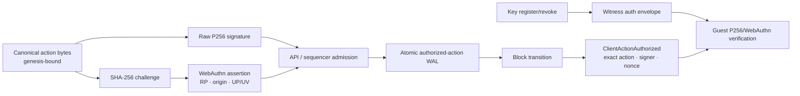

# P256 and WebAuthn authentication

> [!summary] In one paragraph
> Accounts have a committed set of P256 signing keys. Raw agent keys sign
> canonical action bytes directly; passkeys sign a WebAuthn assertion whose
> challenge is the hash of those same bytes. Witness v12 carries key mutations
> and ordinary order/cancel authorization envelopes in actor order. Native and
> guest-safe verification replay the active key set, RawP256/WebAuthn signature,
> exact action, genesis domain, and committed trading nonce. The deployed guest
> commitment moves with the epoch guest in the coordinated #15 repin.

## Key and action model



`KeyRecord` commits auth scheme, compressed SEC1 P256 public key, and a reserved
capability mask through the account's `keys_digest`. All capability bits are
authoritative today; scoped delegation is not active.

## Bootstrap and key mutation

- Public account creation installs its initial key through one sequencer actor
  command and one control-plane WAL row. Legacy bare service-tier creation and
  the deprecated service-tier first-key bootstrap remain separate commands.
- Initial and additional signing-key labels are optional metadata limited to
  128 UTF-8 bytes. Admission measures the original bytes without trimming or
  normalization and rejects oversized labels before account/key/WAL mutation.
- `POST /v1/accounts/{id}/keys` is service-gated and can bootstrap only an
  account with zero keys.
- Additional keys use `POST /v1/accounts/{id}/keys/register`; revocation uses
  `/v1/accounts/{id}/keys/revoke`.
- Each mutation binds the current `keys_digest` and `events_digest` from
  `/v1/accounts/{id}/keyop-state` and is authorized by an active key.
- The witness carries the key operation plus RawP256/WebAuthn envelope. Native
  and guest verification replay the active-key set, canonical bytes, signature,
  WebAuthn RP/origin/challenge, and required user presence/verification.
- The last active key cannot be revoked.

This is the strongest authorization path: the key universe and mutation intent
are validity-checked, not merely accepted by the server.

## Ordinary signed actions

Every canonical signed action begins with a unique versioned domain and binds
the chain `genesis_hash`. This includes orders, cancellations, profile and read
API-key mutations, bridge withdrawals, key operations, and resolution
attestations. Cancellation bytes also bind the account and order ID. For signed
orders and cancellations, the API retains the exact RawP256/WebAuthn envelope,
and the sequencer appends the action, envelope, and nonce in one acknowledged
WAL record before acknowledgement. Recovery reconstructs the same
`ClientActionAuthorized` event.

The account leaf commits a dedicated `last_trading_nonce`. Native and guest-safe
verification require each witnessed order/cancel nonce to be strictly greater
than the authenticated prior value; gaps are allowed. Key mutations and client
actions share actor acknowledgement order, so an action must be authorized by a
scheme-matching key active at that exact point. The action event is then bound
to the accepted/rejected/resting order or later cancellation effect. Profile
and read-key actions continue to use the broader sequencer `last_nonce`; bridge
and resolution paths have their own state machines. They share canonical
domain/genesis protection but remain outside this first trading-intent proof
scope.

Unsigned `POST /v1/orders` is a service route: in production it requires the
service token; dev mode skips that service bearer for local workflows. It is not
a public production trading path.

Signed bridge withdrawal creation is also genesis-bound and nonce-protected,
but remains service-gated scaffolding. The final L1 release remains
proof/root/nullifier controlled; an API signature alone does not move vault
funds.

## WebAuthn details

For a passkey assertion:

```text
challenge = base64url(SHA-256(canonical_action_bytes))
signature covers authenticatorData || SHA-256(clientDataJSON)
```

The API checks credential/public-key association, `webauthn.get`, challenge,
origin, RP ID hash, user presence, user verification, signature shape, and
configured envelope limits. Shared guest-safe verification independently pins
RP `app.62-171-170-238.nip.io`, exact origin
`https://app.62-171-170-238.nip.io`, and rejects `crossOrigin: true`. Changing
either pin is a fresh guest/deployment migration.

Account reads use a separate read-scoped bearer. Passkey login creates such a
bearer after an assertion; read keys cannot trade, withdraw, or mutate signing
keys. An account retains at most 64 read-key records over its lifetime,
including revoked tombstones, and labels are limited to 128 UTF-8 bytes. The
sequencer also serializes the candidate recovery account before accepting a new
read key and keeps it under a conservative 256 KiB budget, well below qMDB's
1 MiB value-codec ceiling.

## Recovery

Register and test a second passkey while an existing key is still usable. There
is no server-side reset or seed phrase. See [Passkey recovery](../../passkey-recovery.md).

## Implementation map

| Concern | Owner |
|---|---|
| Canonical ordinary signing bytes | `crates/sybil-signing` |
| API WebAuthn verification | `crates/sybil-api/src/webauthn.rs`, account/order routes |
| Admission, atomic authorization WAL | `crates/matching-sequencer/src/crypto.rs`, actor/store |
| Key/action/nonce verification | `crates/sybil-verifier/src/client_action.rs`, `system.rs`, `key_transition.rs`, `key_op_auth.rs` |
| Guest verification | `crates/sybil-zk` and OpenVM guest |

## See also

- [[REST API]]
- [[Block Witness]]
- [[Threat Model]]
- [ADR-0007](../../adr/0007-canonical-bytes-domain-separation.md)
- [ADR-0008](../../adr/0008-in-guest-p256-openvm-ecc.md)
- [ADR-0014](../../adr/0014-webauthn-first-auth.md)
