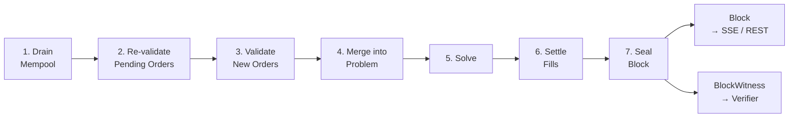

Every second, the sequencer produces a block. The lifecycle is a seven-step pipeline: drain the [[Mempool]], re-validate [[Pending Orders and TTL|pending orders]], validate new submissions, merge everything into a `Problem`, run the solver, settle fills, and seal the block. Two outputs emerge: a `Block` (served to traders via [[SSE Block Stream|SSE]] and [[REST API|REST]]) and a [[Block Witness]] (complete audit trail for the [[Four-Layer Verification|verifier]]).

The flow starts when the `SequencerActor`'s 1-second timer fires. It drains the mempool — pulling orders up to the configured drain limits per pool — then re-validates any pending orders from prior batches (checking TTL expiry and balance sufficiency). New submissions go through order validation: buy orders must have sufficient balance, sell orders must have sufficient positions. Valid orders are merged into a [[The LP Core|`Problem`]] struct containing all orders, markets, MM constraints, and market groups.

The solver (configurable, default [[LP Solver]]) takes the `Problem` and returns a `PipelineResult` with fills, clearing prices, and welfare. [[Settlement]] processes each fill: debiting balances and crediting positions for buyers, the reverse for sellers, with i128 intermediates for overflow safety. Unfilled non-MM orders are persisted as [[Pending Orders and TTL|pending orders]] for the next batch. Finally, the sequencer computes a [[State Root and Parent Hash|state root]] (BLAKE3 hash of all account state), chains the block to its parent via the parent hash, and seals the `Block`. The [[Block Witness]] captures pre-state, post-state, all fills, prices, rejections, and MM constraints — everything needed for independent verification.

## Key Properties
- 1-second batch interval (configurable)
- 7-step pipeline: drain → re-validate → validate → merge → solve → settle → seal
- Two outputs: `Block` (for traders) and `BlockWitness` (for [[Four-Layer Verification|verification]])
- Unfilled orders persist as [[Pending Orders and TTL|pending]] (non-MM only)
- MM quotes are one-shot — consumed each batch, never carried over

## Where This Lives
> `crates/matching-sequencer/src/sequencer.rs` — `BlockSequencer::produce_block()`
> `crates/matching-sequencer/src/actor.rs` — `SequencerActor` with 1-second timer

## See Also
- [[Mempool]] — order buffering before each batch
- [[Settlement]] — fill processing within the lifecycle
- [[Block Witness]] — the audit trail produced alongside each block
- [[State Root and Parent Hash]] — cryptographic block chaining
