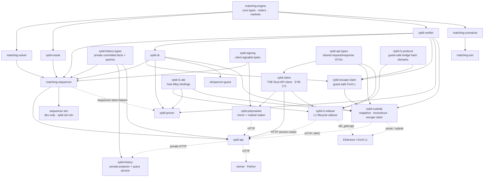

The Rust workspace is organized as a directed acyclic graph (DAG) of crates.
`matching-engine` is the foundation of exchange state and arithmetic; DTO,
client, L1 protocol, and tooling crates can remain independent of it when they
do not need domain types. Dependencies point inward: the engine knows nothing
about solvers or the API.

The dependency DAG flows in three tiers. **Foundation**: `matching-engine` defines the domain model with zero solver logic. **Middle tier**: `matching-solver` (optimization algorithms), `sybil-oracle` (resolution decisions), `sybil-verifier` (block verification and commitment schemas), and `matching-scenarios` (test data generation) all depend on the engine but not on each other. **Top tier**: `matching-sequencer` composes solver + oracle + verifier into the block production pipeline. `sybil-api` wraps the sequencer as an HTTP server. `matching-sim` pulls from scenarios + solver + verifier for benchmarking. `sequencer-sim` is a dev-only harness that drives the sequencer over many batches with synthetic agents (the `sybil-sim` binary); it depends on `matching-sequencer` so that the sequencer library itself ships no simulation code to `sybil-api`.

The ZK boundary is deliberately split from block production. `sybil-zk`
depends on `sybil-verifier` with native qMDB runtime features disabled and
contains the guest-safe transition verifier. `sybil-prover` owns the host-side
proof job type, job-to-guest-input conversion, worker/API artifact surface,
DA publication, and L1 calldata encoding. Its default build depends on
`sybil-verifier` and `sybil-zk` but not on `matching-sequencer`; the optional
`sequencer-store` feature adds the `witgen` subcommands that read persisted
block/proof material from the sequencer store. The sequencer depends on
`sybil-zk` only for the shared serializable qMDB proof structs; it still
produces and persists blocks, witnesses, and qMDB proof material without
assembling prover inputs.

Emergency exit has its own narrow verifier/tool split. `sybil-escape-claim`
owns guest-safe Form-L account/reservation verification and public inputs;
`sybil-custody` composes it with API DTOs, native verifier/qMDB proofs,
`sybil-zk`, HTTP/RPC access, OpenVM proving, and vault calldata. It is a
user-side client and never mutates sequencer state directly.

The client tier sits below the DTO crate. `sybil-api-types` is the shared source of truth for request/response shapes; `sybil-client` is THE Rust HTTP client for `sybil-api` (SYB-171), typed against those DTOs. In-tree Rust consumers use it: `sybil-polymarket` (the mirror + market maker), the `sybil-admin` CLI (a binary inside `sybil-api`), and the dev L1 bridge indexer. It replaced two hand-written clients that had drifted independently — there is now exactly one, so no third should be added. It owns base-url + optional service-token (`SYBIL_SERVICE_TOKEN`) auth, response decoding, bridge service-route helpers, and the SSE block-stream consumption; each consumer keeps its own concerns (the mirror's reconnect loop and poisoned-market parsing, the indexer's L1 JSON-RPC polling, the admin's audit log) around it. `sybil-signing` is separate from the commitment schemas: it owns stable Borsh signable payload bytes for client signatures (orders, cancels, attestations, bridge withdrawals), and is used by the sequencer's signed-write verification and by signing clients.

Historical serving has a dependency-light private contract.
`sybil-history-types` owns the versioned committed-fact batch, projector status,
and internal query DTOs. `matching-sequencer` depends on it only to append the
transactional outbox; standalone `sybil-history` depends on it to project and
query a separate store; `sybil-api` depends on both the sequencer and history
types to deliver the outbox and proxy owner-authorized reads. `sybil-history`
does not depend on the sequencer, verifier, solver, or public API DTO crate.

The L1 bridge scaffolding separates guest-safe protocol domains from host
Ethereum plumbing. `sybil-l1-protocol` owns deposit/withdrawal hash domains and
the small neutral event structs/parser shared with `SybilVault`; it remains
dependency-light because it is compiled into OpenVM guests. `sybil-l1-abi`
owns unconditional Alloy-generated contract calls, structs, and events for
host clients. `sybil-l1-indexer` uses those crates plus `sybil-client`: it
queries L1 through an Alloy provider, resolves the Sybil account through the
service-only reverse bridge-key route, and submits deposits through the
existing API bridge endpoint. The sequencer still receives deposits through
its current `pending_l1_deposits` WAL path; the indexer does not bypass
`sybil-api` or introduce a new storage dependency.

The Python `arena/` sits outside the Rust workspace entirely, connected only via HTTP to `sybil-api`. This clean boundary means the Python bots can be developed, tested, and deployed independently of the Rust code — they only need a running server. The separation also means the arena doesn't need to compile any Rust code, which is important for Python-first developers who want to build bots without a Rust toolchain.

*Note: `matching-sim` also depends on `matching-solver` and `sybil-verifier` — omitted to keep arrows clean. It's a dev tool for benchmarking.*

## Key Properties
- `matching-engine` is the exchange-domain foundation; protocol/client tools
  stay narrower where possible
- No upward dependencies: engine doesn't know about solvers, solvers don't know about API
- Sequencer composes middle-tier crates into the block production pipeline
- `sybil-history-types` is the narrow replay contract; `sybil-history` owns
  product-history storage/query load without depending on the sequencer
- `sybil-zk` is guest-safe verification; `sybil-prover` owns portable proof jobs and host-side prover input construction
- `sybil-prover witgen ...` is sequencer-side tooling for exporting latest-block proof jobs from the store, gated behind `sequencer-store`
- Default `sybil-prover` builds are the proof-job CLI/service boundary and settlement calldata encoder; they do not depend on the sequencer
- Sequencer owns block production and persistence, not prover input assembly; its `sybil-zk` edge is limited to shared qMDB proof structs
- `sybil-signing` is client-signature serialization, not validity-commitment serialization
- `sybil-client` is THE Rust HTTP client (SYB-171): `sybil-polymarket` and the `sybil-admin` CLI both depend on it; no hand-written duplicate should be reintroduced
- `sybil-l1-protocol` stays guest-safe and dependency-light; `sybil-l1-abi` gives host clients one unconditional set of generated Alloy bindings
- `sybil-l1-indexer` uses Alloy plus `sybil-client` to feed the existing bridge WAL entrypoints
- `sybil-escape-claim` is the guest-safe emergency statement;
  `sybil-custody` is the user-side retention/reconstruction/proving client
- Arena connects via HTTP only — no Rust compilation required
- `matching-sim` is a dev tool that cross-cuts multiple crates for benchmarking
- `sequencer-sim` is a dev-only crate: it depends on `matching-sequencer` so the sequencer library stays free of simulation/agent code (nothing `sybil-api` links pulls it in)

## Where This Lives
> `Cargo.toml` — workspace member list and dependency declarations
> Each crate's `Cargo.toml` — specific dependency graph edges

## See Also
- [[Sybil Architecture]] — top-level system overview
- [[Block Lifecycle]] — the pipeline the sequencer orchestrates
- [[REST API]] — the HTTP boundary between Rust and Python
