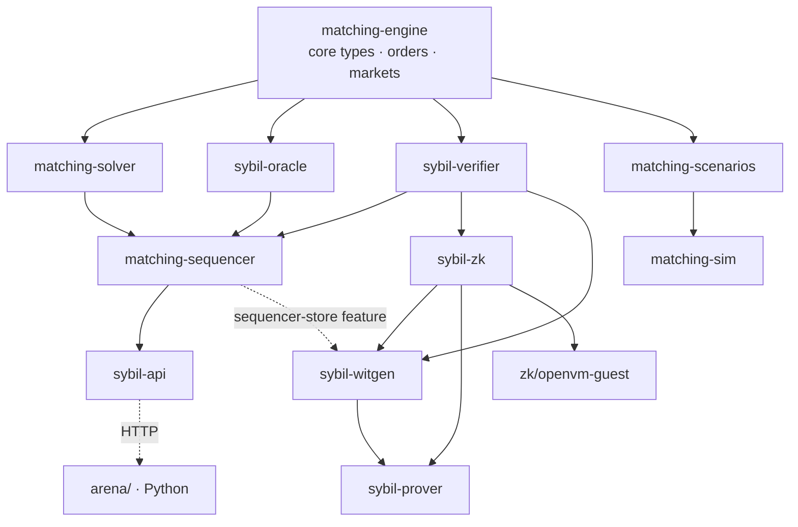

The Rust workspace is organized as a directed acyclic graph (DAG) of crates, with `matching-engine` as the foundation. Every crate depends on `matching-engine` for core types — orders, fills, markets, nanos, market groups, MM constraints. No crate depends upward: the engine knows nothing about solvers, and solvers know nothing about the API.

The dependency DAG flows in three tiers. **Foundation**: `matching-engine` defines the domain model with zero solver logic. **Middle tier**: `matching-solver` (optimization algorithms), `sybil-oracle` (resolution decisions), `sybil-verifier` (block verification and commitment schemas), and `matching-scenarios` (test data generation) all depend on the engine but not on each other. **Top tier**: `matching-sequencer` composes solver + oracle + verifier into the block production pipeline. `sybil-api` wraps the sequencer as an HTTP server. `matching-sim` pulls from scenarios + solver + verifier for benchmarking.

The ZK boundary is deliberately split from block production. `sybil-zk`
depends on `sybil-verifier` with native qMDB runtime features disabled and
contains the guest-safe transition verifier. `sybil-witgen` owns a portable
proof job type and the conversion from that job into guest input. Its core
path depends only on `sybil-verifier` and `sybil-zk`; the optional default
`sequencer-store` feature adds the adapter that reads persisted block/proof
material from `matching-sequencer`. The sequencer does not depend on
`sybil-zk`; it produces and persists blocks, witnesses, and qMDB proof
material. `sybil-prover` is the CLI/service boundary on top of `sybil-witgen`:
it consumes portable proof jobs, emits guest-input artifacts and public input
hashes, and later owns OpenVM proof invocation.

The Python `arena/` sits outside the Rust workspace entirely, connected only via HTTP to `sybil-api`. This clean boundary means the Python bots can be developed, tested, and deployed independently of the Rust code — they only need a running server. The separation also means the arena doesn't need to compile any Rust code, which is important for Python-first developers who want to build bots without a Rust toolchain.

*Note: `matching-sim` also depends on `matching-solver` and `sybil-verifier` — omitted to keep arrows clean. It's a dev tool for benchmarking.*

## Key Properties
- `matching-engine` is the sole foundation — all crates depend on it
- No upward dependencies: engine doesn't know about solvers, solvers don't know about API
- Sequencer composes middle-tier crates into the block production pipeline
- `sybil-zk` is guest-safe verification; `sybil-witgen` owns portable proof jobs and host-side prover input construction
- `sybil-prover` is the proof-job CLI/service boundary; it does not depend on the sequencer
- Sequencer owns block production and persistence, not prover input assembly
- Arena connects via HTTP only — no Rust compilation required
- `matching-sim` is a dev tool that cross-cuts multiple crates for benchmarking

## Where This Lives
> `Cargo.toml` — workspace member list and dependency declarations
> Each crate's `Cargo.toml` — specific dependency graph edges

## See Also
- [[Sybil Architecture]] — top-level system overview
- [[Block Lifecycle]] — the pipeline the sequencer orchestrates
- [[REST API]] — the HTTP boundary between Rust and Python
