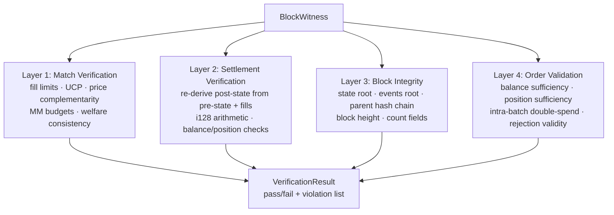

The verifier validates every aspect of a block across four independent layers, each checking a different class of invariant. The input is a [[Block Witness]] — a self-contained audit trail — and the output is a `VerificationResult` with a pass/fail verdict and a list of specific violations. There are 38 distinct violation types across the four layers.

**Layer 1: Match Verification** checks that the solver's output is economically valid. Per-fill checks confirm that each filled order exists, the fill quantity doesn't exceed the order's maximum, and the fill price respects the order's limit. System-wide checks enforce the Uniform Clearing Price (UCP), price complementarity (YES + NO = $1 for binary markets), [[Binary Markets and Market Groups|market group]] price constraints (YES prices sum to at most $1), [[MM Budget Constraint|MM budget]] compliance, and welfare consistency (reported welfare matches recomputed welfare).

**Layer 2: Settlement Verification** re-derives the post-state from the pre-state and fills. It independently runs [[Settlement]] arithmetic (with i128 intermediates) and compares every account's balance and positions against the witness's reported post-state. Any mismatch is a violation.

**Layer 3: Block Integrity** verifies the [[State Root and Parent Hash|cryptographic commitments]]. It recomputes the typed qMDB state root from post-state plus the state sidecar, recomputes the keyless qMDB events root from canonical block events, and checks both match the header. It also verifies parent hash chaining (the header's parent hash equals the hash of the previous header), consecutive block heights, and count fields (order count, fill count).

**Layer 4: Order Validation** checks pre-state feasibility. Buy orders must have sufficient balance in the pre-state. Sell orders must have sufficient positions. Intra-batch double-spend detection catches cases where multiple fills against the same account would overdraw. It also validates rejections: no false rejections (valid orders incorrectly rejected) and no incorrect rejection reasons.

## Key Properties
- 4 independent layers: Match → Settlement → Block Integrity → Order Validation
- 38 distinct violation types across all layers
- Input: [[Block Witness]] (self-contained audit trail)
- Strict mode (for ZK): zero tolerance, no zero fills allowed
- Lenient mode (default): 1000-nano welfare tolerance, zero fills allowed
- Same verification logic will compile into a [[ZK Integration Path|SNARK circuit]]

## Where This Lives
> `crates/sybil-verifier/src/match_verifier.rs` — Layer 1
> `crates/sybil-verifier/src/settlement.rs` — Layer 2
> `crates/sybil-verifier/src/block.rs` — Layer 3 header checks
> `crates/sybil-verifier/src/event_commitment.rs` — Layer 3 events-root commitment
> `crates/sybil-verifier/src/orders.rs` — Layer 4

## See Also
- [[Block Witness]] — the input to verification
- [[Block Lifecycle]] — verification runs after block production
- [[MM Budget Constraint]] — budget compliance checked in Layer 1
- [[ZK Integration Path]] — these checks become the ZK circuit
