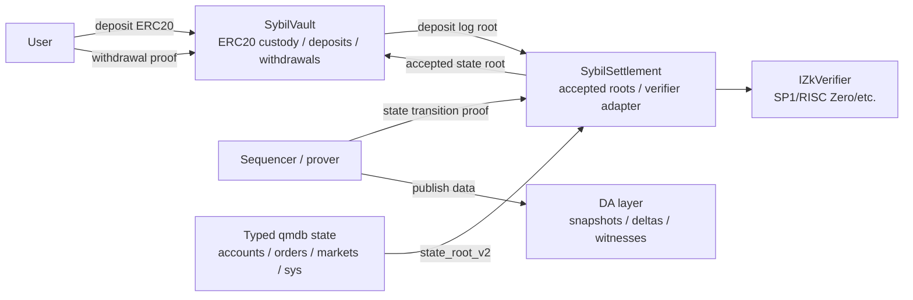

# L1 Settlement and Vault

This note defines the Ethereum contract surface for Sybil before production
Solidity exists. The goal is to make the bridge ambitious but narrow: L1
custodies collateral, accepts validity-proven state roots, and releases funds
only when a proof says the off-chain state permits it.

L1 does not run the prediction market. It does not solve auctions, resolve
markets, replay the order book, or verify qmdb proofs directly in Solidity.
Those checks live in the [[ZK Integration Path|ZK proof]] over the
[[Block Witness]] and the typed [[State Root Schema]].

## Design commitments

- Two contracts carry the production surface: `SybilSettlement` and
  `SybilVault`.
- `SybilSettlement` is the root of trust for accepted state roots.
- `SybilVault` is the only contract that holds user collateral.
- Normal withdrawals are claims against committed withdrawal leaves, not raw
  account balances.
- Emergency self-withdrawal is conservative and proof-backed. It cannot refund
  every user's historical deposits after trading has started.
- DA-backed operator replacement is the primary full recovery path for
  unresolved positions and resting orders.
- qmdb membership and exclusion checks are verified inside ZK proofs. Solidity
  sees succinct proof outputs and accepted root identifiers.

This deliberately leaves the proving-system adapter replaceable. SP1, RISC
Zero, or another verifier can sit behind the same settlement interface.

## Contract split



`SybilSettlement` owns proof acceptance. `SybilVault` queries it for root
validity and owns money movement. This keeps bridge custody separate from
prover-system churn.

## `SybilSettlement`

`SybilSettlement` stores the accepted root chain.

Responsibilities:

- Verify state-transition proofs through an adapter.
- Enforce monotonic block heights.
- Store root metadata needed by withdrawals, DA reconstruction, and operators.
- Expose latest accepted root and root-by-height lookups.
- Track liveness for escape-mode triggers.
- Allow verifier upgrades only through explicit governance.

It should not custody ERC20 tokens. It should not know about user balances,
positions, markets, or order book semantics except through proof public
inputs.

### Root record

The contract stores one record for each accepted height or aggregation
endpoint:

```solidity
struct RootRecord {
    uint64 height;
    bytes32 stateRoot;
    bytes32 previousStateRoot;
    bytes32 blockHash;
    bytes32 eventsRoot;
    bytes32 witnessRoot;
    bytes32 daCommitment;
    bytes32 depositRoot;
    uint64 depositCount;
    uint64 verifiedAt;
    uint32 verifierVersion;
}
```

`daCommitment` is an opaque commitment until [[Persistence|DA publication]]
and operator replacement are fully specified. L1 stores it so users can bind a
root to the data publication the operator claimed to make, but the vault does
not assume that `daCommitment` alone makes the data available.

`depositRoot` and `depositCount` bind a state transition to the L1 deposit log
snapshot the proof used. This prevents an off-chain block from crediting
unbacked deposits.

### State transition proof

State-transition public inputs:

```solidity
struct StateTransitionPublicInputs {
    uint64 previousHeight;
    uint64 newHeight;
    bytes32 previousStateRoot;
    bytes32 newStateRoot;
    bytes32 blockHash;
    bytes32 eventsRoot;
    bytes32 witnessRoot;
    bytes32 daCommitment;
    bytes32 depositRoot;
    uint64 depositCount;
}
```

Verification checks:

1. `previousHeight == latestHeight`, unless this is genesis.
2. `previousStateRoot == latestStateRoot`, unless this is genesis.
3. `newHeight > previousHeight`.
4. `depositRoot` and `depositCount` match a deposit-log checkpoint recorded by
   `SybilVault`.
5. The verifier adapter accepts the proof and public inputs.
6. The resulting `newStateRoot` is not zero and not already accepted at a
   different height.

The ZK program proves the actual exchange transition: order validity,
settlement arithmetic, state-root update, qmdb path checks, deposit
consumption, and any withdrawal-leaf creation. The contract only checks the
succinct proof result.

Aggregation fits this interface: an aggregated proof can move from
`previousHeight` to `newHeight` and store only the endpoint root. Any pending
withdrawal leaf must remain in typed state until claimed or expired, so users
do not need every intermediate root on L1.

### Verifier adapter

The stable interface is intentionally small:

```solidity
interface IZkVerifier {
    function verify(bytes calldata proof, bytes32 publicInputHash)
        external
        view
        returns (bool);
}
```

Each proving system gets an adapter that knows how to hash and marshal its
public inputs. `SybilSettlement` stores the active adapter and a
`verifierVersion`. Upgrades are allowed only through the admin-governance path
defined below; historical roots retain the verifier version that accepted
them.

## `SybilVault`

`SybilVault` holds the collateral token, emits deposits for the sequencer to
consume, verifies withdrawal proofs against accepted roots, queues
withdrawals, and transfers funds after a delay.

The first production asset should be one ERC20 stablecoin. Multi-asset support
can be added by domain-separating asset ids in deposit and withdrawal leaves,
but the initial contract should not generalize prematurely.

### Deposits

Deposits are asynchronous:

1. User calls `deposit(amount, sybilAccountKey)`.
2. Vault transfers ERC20 from the user.
3. Vault appends a deposit leaf to the L1 deposit log.
4. Vault emits `DepositReceived`.
5. Sequencer consumes deposits in id order and credits Sybil accounts through
   system events.
6. The state-transition proof verifies credited deposit leaves against the L1
   deposit-log root and advances the committed deposit cursor in `sys/*`
   state.

Deposit leaf:

```text
deposit_leaf =
    SHA256(
        "sybil/l1-deposit/v1"
     || chain_id
     || vault_address
     || deposit_id
     || token_address
     || sender
     || sybil_account_key
     || amount
    )
```

The simplest deposit log is an append-only Merkle accumulator with
`depositRootByCount[count] = root`. Storing every root is acceptable for
testnet and keeps the proof interface simple. Production can checkpoint roots
less frequently if gas becomes material.

Sequential deposit consumption is a deliberate simplifying constraint. It
lets typed state carry a single `sys/deposit_cursor` rather than an unbounded
set of consumed deposit ids.

### Normal withdrawals

Normal withdrawals are sequencer-cooperative:

1. User requests withdrawal through the Sybil API.
2. Sequencer debits or reserves the account inside Sybil.
3. A typed `withdrawal/{withdrawal_id}` leaf appears in the state root.
4. User submits a ZK withdrawal proof to `SybilVault`.
5. Vault queues the withdrawal.
6. After `withdrawalDelay`, anyone can finalize and transfer funds to the
   recipient.

Withdrawal leaf:

```text
withdrawal_leaf =
    "sybil/state/withdrawal/v1"
 || withdrawal_id
 || account_id
 || recipient
 || token_address
 || amount
 || expiry_height
 || nullifier
```

The proof statement is:

> Against an accepted `stateRoot`, a typed withdrawal leaf exists with
> `recipient`, `token`, `amount`, and `nullifier`, and the leaf was produced by
> a valid Sybil state transition.

The vault records `nullifier` as used when the withdrawal is requested. The
withdrawal leaf should remain in off-chain state until the sequencer observes
the L1 request/finalization and retires it in a later block. That keeps
normal withdrawals replay-safe without letting users withdraw from stale raw
balances while continuing to trade.

### Withdrawal queue

`requestWithdrawal` verifies the proof and creates:

```solidity
struct QueuedWithdrawal {
    address recipient;
    address token;
    uint256 amount;
    bytes32 nullifier;
    bytes32 stateRoot;
    uint64 height;
    uint64 requestedAt;
    uint64 executableAt;
    bool finalized;
    bool canceled;
}
```

Rules:

- `stateRoot` must be accepted by `SybilSettlement`.
- `nullifier` must not be used or queued.
- `amount > 0`.
- `recipient` and `token` must match the proof public inputs.
- `executableAt = block.timestamp + withdrawalDelay`.
- Finalization transfers ERC20 and marks the queue item finalized.

The delay is an operational safety window, not a fraud-proof window. ZK proofs
are validity proofs, but the delay gives the guardian time to pause if the
verifier adapter, public-input encoding, or deployment configuration is wrong.

### Emergency escape

Escape mode is entered when roots stop arriving:

```text
block.timestamp > latestRoot.verifiedAt + escapeTimeout
```

Anyone may activate escape mode after the timeout. Governance may also pause
first during an incident, but pausing alone does not prove the operator is
dead.

Escape claims are proof-backed cash withdrawals from the latest accepted root:

1. User obtains the latest accepted root and state data from DA or their own
   archive.
2. User proves account ownership plus `acct/{account_id}` and
   `acct_resv/{account_id}` membership against that root.
3. The ZK proof computes conservative withdrawable cash:

```text
withdrawable_cash = max(0, balance - open_cash_reservations)
```

4. Vault accepts at most one escape claim per account/root nullifier.

This does not recover unresolved positions, resting orders, or claims on
future market resolutions. That is intentional. Unwinding those on L1 would
move prediction-market resolution and settlement logic into the vault, which
is the wrong boundary for a validium.

The full recovery path is DA-backed operator replacement: reconstruct complete
typed state, verify it against `stateRoot`, and continue the exchange with a
replacement operator. The L1 vault exists to enforce custody and conservative
cash exits, not to become a fallback matching engine.

### Rejected escape: refund historical deposits

Refunding every user's historical deposits is not solvent after trading
starts. A user may have lost money, transferred value through trades, or
converted cash into unresolved positions. Returning raw deposits would let
losing accounts over-withdraw and drain winners' collateral.

The only safe variants are:

- unused/unconsumed deposits that never entered Sybil state;
- proof-backed withdrawable cash from an accepted root;
- a normal withdrawal leaf already created by the sequencer;
- full operator replacement from available state data.

## Roles and governance

Initial testnet roles:

| Role | Contract | Capability |
|---|---|---|
| `DEFAULT_ADMIN` | both | configure roles; held by multisig |
| `PAUSER` | both | pause root submission, deposits, withdrawal requests, or finalization |
| `VERIFIER_ADMIN` | settlement | schedule verifier adapter upgrade |
| `PARAMETER_ADMIN` | vault | tune `withdrawalDelay` and `escapeTimeout` within caps |
| `GUARDIAN` | vault | cancel queued withdrawals during pause with reason |

Production should move verifier and parameter changes behind a timelock.
Testnet may use a Safe multisig without timelock while the verifier is still
changing.

Pausing should be granular:

- pause deposits;
- pause root submissions;
- pause new withdrawal requests;
- pause withdrawal finalization.

Granular pauses avoid freezing unrelated user paths during a narrow incident.

## Events

Minimum events:

```solidity
event DepositReceived(
    uint64 indexed depositId,
    address indexed sender,
    bytes32 indexed sybilAccountKey,
    address token,
    uint256 amount,
    bytes32 depositRoot
);

event StateRootVerified(
    uint64 indexed height,
    bytes32 indexed stateRoot,
    bytes32 previousStateRoot,
    bytes32 blockHash,
    bytes32 daCommitment,
    bytes32 depositRoot,
    uint64 depositCount,
    uint32 verifierVersion
);

event WithdrawalRequested(
    bytes32 indexed nullifier,
    address indexed recipient,
    address token,
    uint256 amount,
    bytes32 stateRoot,
    uint64 height,
    uint64 executableAt
);

event WithdrawalFinalized(bytes32 indexed nullifier, address indexed recipient, uint256 amount);
event WithdrawalCanceled(bytes32 indexed nullifier, string reason);
event EscapeModeActivated(uint64 indexed height, bytes32 indexed stateRoot, uint64 activatedAt);
event VerifierUpgraded(uint32 indexed version, address verifier);
event ParameterUpdated(bytes32 indexed key, uint256 oldValue, uint256 newValue);
```

## Errors

Minimum custom errors:

```solidity
error InvalidProof();
error UnknownStateRoot(bytes32 stateRoot);
error NonMonotonicHeight(uint64 expectedPrevious, uint64 providedPrevious);
error DepositRootMismatch(bytes32 expectedRoot, bytes32 providedRoot);
error WithdrawalAlreadyUsed(bytes32 nullifier);
error WithdrawalNotReady(bytes32 nullifier, uint64 executableAt);
error WithdrawalCanceled(bytes32 nullifier);
error EscapeModeInactive();
error EscapeModeAlreadyActive();
error AmountZero();
error TokenUnsupported(address token);
```

## Public interfaces

Sketch only; exact ABI lands with the Foundry skeleton.

```solidity
interface ISybilSettlement {
    function submitStateRoot(
        StateTransitionPublicInputs calldata inputs,
        bytes calldata proof
    ) external;

    function isAcceptedRoot(bytes32 stateRoot) external view returns (bool);
    function latestHeight() external view returns (uint64);
    function latestStateRoot() external view returns (bytes32);
    function rootAt(uint64 height) external view returns (RootRecord memory);
}

interface ISybilVault {
    function deposit(uint256 amount, bytes32 sybilAccountKey) external;

    function requestWithdrawal(
        WithdrawalPublicInputs calldata inputs,
        bytes calldata proof
    ) external returns (bytes32 nullifier);

    function finalizeWithdrawal(bytes32 nullifier) external;
    function activateEscapeMode() external;
}
```

Withdrawal public inputs:

```solidity
struct WithdrawalPublicInputs {
    bytes32 stateRoot;
    uint64 height;
    bytes32 nullifier;
    address recipient;
    address token;
    uint256 amount;
    bytes32 claimKind; // normal withdrawal leaf or emergency cash escape
}
```

`claimKind` separates normal withdrawal leaves from emergency cash exits.
Those are different ZK programs or different verifier keys even if they share
the same vault entrypoint.

## Interaction with typed state

The L1 contract design assumes these typed leaves exist or will exist under
[[State Root Schema]]:

| Key family | L1 relevance |
|---|---|
| `acct/{account_id}` | ownership, balance, withdrawal metadata |
| `acct_resv/{account_id}` | cash reservations that reduce emergency withdrawable cash |
| `withdrawal/{withdrawal_id}` | normal withdrawal claims |
| `sys/deposit_cursor` | highest sequential L1 deposit consumed by Sybil state |
| `sys/bridge_config` | token id, chain id, vault address, bridge version |

`withdrawal/{withdrawal_id}` is a new key family relative to the current
state-root note. It is small and additive, and it avoids proving withdrawals
from stale raw balances.

## Development sequence

1. **RFC**: this note.
2. **Foundry skeleton**: contracts, interfaces, events, custom errors, mock
   verifier, mock ERC20, and state-machine tests. No real proof system.
3. **Sequencer bridge hooks**: consume L1 deposits in order; create typed
   withdrawal leaves; expose proof-generation data.
4. **Verifier integration**: plug in the chosen ZK verifier adapter and
   public-input hash.
5. **DA/operator replacement**: bind `daCommitment` to the chosen DA layer and
   implement reconstruction tooling.
6. **Sepolia deployment**: real deployment, monitoring, pause runbook, and
   frontend withdrawal countdown.

This sequencing keeps current exchange development loose. The immediate code
surface after this RFC can be a contract sandbox with mocks; Rust crates do
not need to depend on Solidity until deposit consumption and withdrawal leaves
are implemented.

## Open questions

1. **Verifier public-input hashing.** Depends on SYB-27/SYB-30. The contract
   should hash canonical public inputs once and pass a digest to the adapter,
   but the exact hash may be prover-specific.
2. **Deposit accumulator implementation.** A full Merkle accumulator is easy
   for proofs but costs more gas than a rolling hash. Choose during the
   Foundry skeleton, with tests for proof compatibility.
3. **Withdrawal leaf expiry.** Normal withdrawal leaves should expire if never
   requested on L1, but expiry must be long enough for delayed proof
   generation and DA retrieval.
4. **Account-to-recipient binding.** The withdrawal proof must bind a Sybil
   account to an Ethereum recipient. The exact key path depends on the account
   authentication model in [[P256 Authentication]] and any future wallet-link
   flow.
5. **Escape-mode deactivation.** Decide whether a new valid root can
   automatically leave escape mode or whether governance must explicitly
   resume.

## Related Linear tickets

- SYB-30: on-chain verifier contract.
- SYB-31: deposit/withdraw Solidity contracts.
- SYB-32: escape hatch.
- SYB-76: DA commitment design.
- SYB-80: escape-hatch data reconstruction.
- SYB-95: Sepolia deployment with DA cadence.
- SYB-96: pause and admin-key governance.
- SYB-97: withdrawal queue and delay parameters.
- SYB-116: operator replacement and emergency state disclosure.

## See also

- [[State Root Schema]] - typed state leaves that withdrawals prove against.
- [[ZK Integration Path]] - proof pipeline and on-chain root verification.
- [[Proof Architecture]] - authenticated data and proof composition.
- [[Block Witness]] - private/public proof input split.
- [[Settlement]] - off-chain balance and position mutation.
- [[P256 Authentication]] - user key model that withdrawal proofs bind to.
