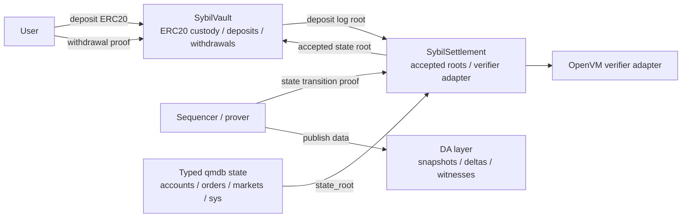

# L1 Settlement and Vault

This note defines the Ethereum contract surface for Sybil before production
Solidity exists. The goal is to make the bridge ambitious but narrow: L1
custodies collateral, accepts validity-proven state roots, and releases funds
only when a proof says the off-chain state permits it.

L1 does not run the prediction market. It does not solve auctions, resolve
markets, replay the order book, or verify qmdb proofs directly in Solidity.
Those checks live in the [[ZK Integration Path|ZK proof]] over the
[[Block Witness]] and the typed [[State Root Schema]].

## Design commitments

- Two contracts carry the production surface: `SybilSettlement` and
  `SybilVault`.
- `SybilSettlement` is the root of trust for accepted state roots.
- `SybilVault` is the only contract that holds user collateral.
- Normal withdrawals are claims against committed withdrawal leaves, not raw
  account balances.
- Emergency self-withdrawal is conservative and proof-backed. It cannot refund
  every user's historical deposits after trading has started.
- DA-backed operator replacement is the primary full recovery path for
  unresolved positions and resting orders.
- qmdb membership and exclusion checks are verified inside ZK proofs. Solidity
  sees succinct proof outputs and accepted root identifiers.
- Contracts are written in Solidity and tested with Foundry.
- State-transition and withdrawal proofs use OpenVM. The contracts call an
  OpenVM verifier adapter rather than embedding prover-system details in the
  vault.

The verifier adapter remains a boundary because the OpenVM Solidity SDK may
change public-input marshalling or verifier deployment details. It is not a
signal that Sybil is prover-agnostic: OpenVM is the chosen proving stack.

## Contract split



`SybilSettlement` owns proof acceptance. `SybilVault` queries it for root
validity and owns money movement. This keeps bridge custody separate from
prover-system churn.

## `SybilSettlement`

`SybilSettlement` stores the accepted root chain.

Responsibilities:

- Verify state-transition proofs through an adapter.
- Enforce monotonic block heights.
- Store root metadata needed by withdrawals, DA reconstruction, and operators.
- Expose latest accepted root and root-by-height lookups.
- Track liveness for escape-mode triggers.
- Allow verifier upgrades only through explicit governance.

It should not custody ERC20 tokens. It should not know about user balances,
positions, markets, or order book semantics except through proof public
inputs.

### Root record

The contract stores one record for each accepted height or aggregation
endpoint:

```solidity
struct RootRecord {
    uint64 height;
    bytes32 stateRoot;
    bytes32 previousStateRoot;
    bytes32 blockHash;
    bytes32 eventsRoot;
    bytes32 witnessRoot;
    bytes32 daCommitment;
    bytes32 depositRoot;
    uint64 depositCount;
    uint64 verifiedAt;
    uint32 verifierVersion;
}
```

`daCommitment` is the [[Data Availability]] envelope proven by OpenVM and
stored by L1. It binds the root record to a canonical witness payload,
payload length, and provider-reference hash. The current provider-reference
hash is the empty set, so the first implementation commits to the data before
choosing a production DA network. The vault still does not assume that
`daCommitment` alone makes the data available.

`depositRoot` and `depositCount` bind a state transition to the L1 deposit log
snapshot the proof used. This prevents an off-chain block from crediting
unbacked deposits.

### State transition proof

State-transition public inputs:

```solidity
struct StateTransitionPublicInputs {
    uint64 previousHeight;
    uint64 newHeight;
    bytes32 previousStateRoot;
    bytes32 newStateRoot;
    bytes32 blockHash;
    bytes32 eventsRoot;
    bytes32 witnessRoot;
    bytes32 daCommitment;
    bytes32 depositRoot;
    uint64 depositCount;
}
```

Verification checks:

1. `previousHeight == latestHeight`, unless this is genesis.
2. `previousStateRoot == latestStateRoot`, unless this is genesis.
3. `newHeight > previousHeight`.
4. `depositRoot` and `depositCount` match a deposit-log checkpoint recorded by
   `SybilVault`.
5. The verifier adapter accepts the proof and public inputs.
6. The resulting `newStateRoot` is not zero and not already accepted at a
   different height.

The ZK program proves the actual exchange transition: order validity,
settlement arithmetic, state-root update, qmdb path checks, deposit
consumption, and any withdrawal-leaf creation. The contract only checks the
succinct proof result.

Aggregation fits this interface: an aggregated proof can move from
`previousHeight` to `newHeight` and store only the endpoint root. Any pending
withdrawal leaf must remain in typed state until claimed or expired, so users
do not need every intermediate root on L1.

### OpenVM verifier adapter

The stable interface is intentionally small:

```solidity
interface IOpenVmVerifierAdapter {
    function verify(bytes calldata proof, bytes32 publicInputHash)
        external
        view
        returns (bool);
}
```

`OpenVmVerifierAdapter` owns the OpenVM Solidity SDK integration.
`SybilSettlement` computes Sybil's public-input hash and passes it to the
adapter; the OpenVM guest program exposes the same digest as the first user
public value. The adapter checks four things before returning true:

1. The proof payload decodes as `(bytes publicValues, bytes proofData, bytes32 appExeCommit, bytes32 appVmCommit)`.
2. `appExeCommit` and `appVmCommit` equal the Sybil guest commitments pinned in the adapter constructor.
3. `publicValues` has the default OpenVM EVM-verifier length of 32 bytes and equals `publicInputHash`.
4. The generated OpenVM Halo2 verifier accepts `proofData` for those public values and pinned commits.

This extra commit pinning is part of the soundness boundary: a generic OpenVM
Halo2 verifier proves only that some committed OpenVM program ran. The adapter
must additionally prove that the committed program is the Sybil state-transition
guest.

For Anvil-only plumbing, `UnsafeAcceptAllVerifierAdapter` implements the same
interface and returns true for every proof. This is intentionally isolated
under `contracts/src/dev/` so settlement and vault logic never learn about a
bypass flag; production and public testnet deployments must use a real
verifier adapter.

Public-input hash:

```text
state_transition_public_input_hash =
    keccak256(abi.encode(
        "sybil/openvm/state-transition/v1",
        previousHeight,
        newHeight,
        previousStateRoot,
        newStateRoot,
        blockHash,
        eventsRoot,
        witnessRoot,
        daCommitment,
        depositRoot,
        depositCount
    ))
```

The host submitter tooling derives this struct from the prepared
`StateTransitionGuestInput`, computes the same Rust-side
`state_transition_public_input_hash`, and writes ABI calldata for
`submitStateRoot(inputs, proof)`. For real OpenVM EVM proof JSON, the submitter
converts OpenVM's `{user_public_values, proof_data, app_*_commit}` shape into
the adapter ABI payload before embedding it as the settlement `proof` bytes.
The contract remains the source of truth for sequencing, deposit-root
checkpoint checks, and verifier-adapter acceptance.

`SybilSettlement` stores the active adapter and a `verifierVersion`. Upgrades
are allowed only through the admin-governance path defined below; historical
roots retain the verifier version that accepted them.

## `SybilVault`

`SybilVault` holds the collateral token, emits deposits for the sequencer to
consume, verifies withdrawal proofs against accepted roots, queues
withdrawals, and transfers funds after a delay.

The first production asset is one USDC-like ERC20 with 6 decimals. Multi-asset
support can be added by domain-separating asset ids in deposit and withdrawal
leaves, but the initial contract should not generalize prematurely. Sybil's
internal accounting remains nanos; for the initial asset, conversion is exact:

```text
amount_nanos = amount_token_units * 1_000
```

### Deposits

Deposits are asynchronous:

1. User calls `deposit(amount, sybilAccountKey)`.
2. Vault transfers ERC20 from the user.
3. Vault appends a deposit leaf to the L1 deposit log.
4. Vault emits `DepositReceived`.
5. Sequencer consumes deposits in id order and credits Sybil accounts through
   system events.
6. The state-transition proof verifies credited deposit leaves against the L1
   deposit-log root and advances the committed deposit cursor in `sys/*`
   state.

Deposit leaf:

```text
deposit_leaf =
    keccak256(abi.encode(
        "sybil/l1-deposit/v1",
        chain_id,
        vault_address,
        deposit_id,
        token_address,
        sender,
        sybil_account_key,
        amount_token_units
    ))
```

Deposit tree:

```text
leaf_i = keccak256(0x00 || deposit_leaf_i)
node   = keccak256(0x01 || left || right)
```

The vault maintains a fixed-depth incremental Merkle tree with depth 32,
supporting up to `2^32` deposits before migration. `deposit_id` starts at 1,
and `depositRootByCount[deposit_id]` stores the root after that deposit is
appended. Empty subtrees use deterministic zero hashes:

```text
zero_0 = bytes32(0)
zero_n = keccak256(0x01 || zero_{n-1} || zero_{n-1})
```

This is more gas than a rolling hash, but it gives clean inclusion proofs for
OpenVM and unambiguous deposit-log checkpoints for `SybilSettlement`.

The state-transition proof binds to a checkpoint:

```text
inputs.depositRoot == vault.depositRootByCount(inputs.depositCount)
```

The proof then verifies that every newly credited deposit is included in the
prefix ending at `depositCount` and that typed state advances
`sys/deposit_cursor` monotonically. Deposits must be consumed in id order.
That keeps typed state to a single cursor rather than an unbounded consumed-id
set.

The Rust/OpenVM path now reconstructs the deposit checkpoint root inside the
guest from the private `BlockWitness.l1_deposits` prefix using the same
`sybil-l1-protocol` leaf/node domains as the vault. Each credited
`L1Deposit` system event must match the included prefix entry by deposit id,
account key, amount conversion, and cumulative post-deposit root. The
sequencer also recomputes the expected root before accepting a service-gated
L1 deposit, so honest witness generation and crash recovery use the same
prefix the guest proves.

Remaining bridge hardening is narrower: the sidecar/indexer still owns L1
log finality/reorg policy, and cross-language golden vectors should add the
Solidity side of `deposit_leaf`/root/public-input hashes. The Rust-Rust vector
coverage lives in `sybil-l1-protocol` and the OpenVM guest imports those
guest-clean primitives directly.

### Normal withdrawals

Normal withdrawals are sequencer-cooperative:

1. User requests withdrawal through the Sybil API.
2. Sequencer debits or reserves the account inside Sybil.
3. A typed `withdrawal/{withdrawal_id}` leaf appears in the state root.
4. User submits a ZK withdrawal proof to `SybilVault`.
5. Vault queues the withdrawal.
6. After `withdrawalDelay`, anyone can finalize and transfer funds to the
   recipient.

Withdrawal leaf:

```text
withdrawal_leaf_bytes =
    "sybil/state/withdrawal"
 || withdrawal_id:u64
 || account_id:u64
 || recipient:address
 || token:address
 || amount_token_units:u64
 || amount_nanos:u64
 || expiry_height:u64
 || nullifier:bytes32
```

For the initial USDC-like asset, the ZK program verifies:

```text
amount_nanos == amount_token_units * 1_000
```

The nullifier is:

```text
nullifier = keccak256(abi.encode(
    "sybil/withdrawal-nullifier/v1",
    chain_id,
    vault_address,
    withdrawal_id,
    account_id,
    recipient,
    token_address,
    amount_token_units
))
```

The nullifier deliberately does not include `stateRoot`. A withdrawal leaf may
persist across multiple accepted roots until claimed or expired; including the
root would allow replaying the same withdrawal through a later root.

The proof statement is:

> Against an accepted `stateRoot`, a typed withdrawal leaf exists with
> `recipient`, `token`, `amount`, and `nullifier`, and the leaf was produced by
> a valid Sybil state transition.

The vault records `nullifier` as used when the withdrawal is requested. The
withdrawal leaf remains in off-chain state until the sequencer observes a
terminal outcome. Finalization retires it without a credit. L1 cancellation or
the confirmed L1 scan cursor advancing past `expiry_height` refunds the exact
debited nanos to the owner once. The terminal event and leaf deletion commit in
the same block, and later duplicate/crossed observations are no-ops. That keeps
normal withdrawals replay-safe without letting users withdraw from stale raw
balances while continuing to trade.

The current API exposes two scaffolding paths into the same sequencer
withdrawal WAL: a service-only unsigned operator path and a service-only signed
path that verifies a P256 signature over the canonical withdrawal payload
against the account key registry. The signed path proves Sybil-account intent
and fail-closes when `expiry_height` is omitted, but L1 release still depends on
future SYB-178/SYB-188 withdrawal-proof and vault-authorization work.

### Withdrawal queue

`requestWithdrawal` verifies the proof and creates:

```solidity
struct QueuedWithdrawal {
    address recipient;
    address token;
    uint256 amount;
    bytes32 nullifier;
    bytes32 stateRoot;
    uint64 height;
    uint64 requestedAt;
    uint64 executableAt;
    bool finalized;
    bool canceled;
}
```

Rules:

- `stateRoot` must be accepted by `SybilSettlement`.
- `nullifier` must not be used or queued.
- `amount > 0`.
- `recipient` and `token` must match the proof public inputs.
- `executableAt = block.timestamp + withdrawalDelay`.
- Finalization transfers ERC20 and marks the queue item finalized.

The delay is an operational safety window, not a fraud-proof window. ZK proofs
are validity proofs, but the delay gives the guardian time to pause if the
verifier adapter, public-input encoding, or deployment configuration is wrong.

### Emergency escape

Escape mode is entered when roots stop arriving:

```text
block.timestamp > livenessReference + escapeTimeout
```

`livenessReference` is `latestRoot.verifiedAt` once any root has been accepted.
Before the first accepted root it falls back to the vault deployment time
(`deployedAt`), so deposits made before the operator ever produced a root are
not trapped if the operator disappears pre-genesis. Anyone may activate escape
mode after the timeout. Governance may also pause first during an incident, but
pausing alone does not prove the operator is dead.

> **Unimplemented mechanism (status: not shipped).** The proof-backed escape
> *cash claim* described below does **not** exist in the deployed contracts.
> Activating escape mode currently only sets the `escapeModeActive` flag and
> emits `EscapeModeActivated`; there is no `escapeClaim`/`escapeWithdraw`
> entrypoint. Implementing it soundly requires a **distinct ZK guest program**
> — one proving `acct`/`acct_resv` membership against the latest accepted root
> and computing conservative withdrawable cash — which has a different
> public-input shape and app commitment than the single state-transition/
> withdrawal guest the `OpenVmVerifierAdapter` is pinned to. That is a new
> guest plus a `claimKind`-dispatched verifier, out of scope for the contract
> layer alone. Tracked as SYB-32 / SYB-80 (H14).
>
> Until it ships the vault **fails closed**: `requestWithdrawal` rejects any
> `claimKind != CLAIM_KIND_NORMAL` (`UnsupportedClaimKind`), and the
> `CLAIM_KIND_ESCAPE` constant that previously advertised the absent mechanism
> has been removed. `claimKind` remains bound into the withdrawal public-input
> hash so a future escape entrypoint can be added without changing the proof
> shape of normal withdrawals.

When implemented, escape claims are intended to be proof-backed cash
withdrawals from the latest accepted root:

1. User obtains the latest accepted root and state data from DA or their own
   archive.
2. User proves account ownership plus `acct/{account_id}` and
   `acct_resv/{account_id}` membership against that root.
3. The ZK proof computes conservative withdrawable cash:

```text
withdrawable_cash = max(0, balance - open_cash_reservations)
```

4. Vault accepts at most one escape claim per account/root nullifier.

This does not recover unresolved positions, resting orders, or claims on
future market resolutions. That is intentional. Unwinding those on L1 would
move prediction-market resolution and settlement logic into the vault, which
is the wrong boundary for a validium.

The full recovery path is DA-backed operator replacement: reconstruct complete
typed state, verify it against `stateRoot`, and continue the exchange with a
replacement operator. The L1 vault exists to enforce custody and conservative
cash exits, not to become a fallback matching engine.

### Rejected escape: refund historical deposits

Refunding every user's historical deposits is not solvent after trading
starts. A user may have lost money, transferred value through trades, or
converted cash into unresolved positions. Returning raw deposits would let
losing accounts over-withdraw and drain winners' collateral.

The only safe variants are:

- unused/unconsumed deposits that never entered Sybil state;
- proof-backed withdrawable cash from an accepted root;
- a normal withdrawal leaf already created by the sequencer;
- full operator replacement from available state data.

## Roles and governance

Initial testnet roles:

| Role | Contract | Capability |
|---|---|---|
| `DEFAULT_ADMIN` | both | configure roles; held by multisig |
| `PAUSER` | both | pause root submission, deposits, withdrawal requests, or finalization |
| `VERIFIER_ADMIN` | settlement | schedule verifier adapter upgrade |
| `PARAMETER_ADMIN` | vault | tune `withdrawalDelay` and `escapeTimeout` within caps |
| `GUARDIAN` | vault | cancel queued withdrawals during pause with reason |

Testnet decision: use a Safe multisig, granular pause, and no timelock while
the verifier adapter and public-input encoding are still changing.

Production decision: verifier upgrades, `withdrawalDelay`, and
`escapeTimeout` changes go through a timelock. Emergency pause may remain
immediate, but unpause should require multisig review.

Pausing should be granular:

- pause deposits;
- pause root submissions;
- pause new withdrawal requests;
- pause withdrawal finalization.

Granular pauses avoid freezing unrelated user paths during a narrow incident.

## Events

Minimum events:

```solidity
event DepositReceived(
    uint64 indexed depositId,
    address indexed sender,
    bytes32 indexed sybilAccountKey,
    address token,
    uint256 amount,
    bytes32 depositRoot
);

event StateRootVerified(
    uint64 indexed height,
    bytes32 indexed stateRoot,
    bytes32 previousStateRoot,
    bytes32 blockHash,
    bytes32 daCommitment,
    bytes32 depositRoot,
    uint64 depositCount,
    uint32 verifierVersion
);

event WithdrawalRequested(
    bytes32 indexed nullifier,
    address indexed recipient,
    address token,
    uint256 amount,
    bytes32 stateRoot,
    uint64 height,
    uint64 executableAt
);

event WithdrawalFinalized(bytes32 indexed nullifier, address indexed recipient, uint256 amount);
event WithdrawalCanceled(bytes32 indexed nullifier, string reason);
event EscapeModeActivated(uint64 indexed height, bytes32 indexed stateRoot, uint64 activatedAt);
event VerifierUpgraded(uint32 indexed version, address verifier);
event ParameterUpdated(bytes32 indexed key, uint256 oldValue, uint256 newValue);
```

## Errors

Minimum custom errors:

```solidity
error InvalidProof();
error UnsupportedClaimKind(bytes32 claimKind);
error UnknownStateRoot(bytes32 stateRoot);
error NonMonotonicHeight(uint64 expectedPrevious, uint64 providedPrevious);
error DepositRootMismatch(bytes32 expectedRoot, bytes32 providedRoot);
error WithdrawalAlreadyUsed(bytes32 nullifier);
error WithdrawalNotReady(bytes32 nullifier, uint64 executableAt);
error WithdrawalCanceled(bytes32 nullifier);
error EscapeModeInactive();
error EscapeModeAlreadyActive();
error AmountZero();
error TokenUnsupported(address token);
```

## Public interfaces

Sketch only; exact ABI lands with the Foundry skeleton.

```solidity
interface ISybilSettlement {
    function submitStateRoot(
        StateTransitionPublicInputs calldata inputs,
        bytes calldata proof
    ) external;

    function isAcceptedRoot(bytes32 stateRoot) external view returns (bool);
    function latestHeight() external view returns (uint64);
    function latestStateRoot() external view returns (bytes32);
    function rootAt(uint64 height) external view returns (RootRecord memory);
}

interface ISybilVault {
    function deposit(uint256 amount, bytes32 sybilAccountKey) external;

    function requestWithdrawal(
        WithdrawalPublicInputs calldata inputs,
        bytes calldata proof
    ) external returns (bytes32 nullifier);

    function finalizeWithdrawal(bytes32 nullifier) external;
    function activateEscapeMode() external;
}
```

Withdrawal public inputs:

```solidity
struct WithdrawalPublicInputs {
    bytes32 stateRoot;
    uint64 height;
    bytes32 nullifier;
    address recipient;
    address token;
    uint256 amount;
    bytes32 claimKind; // normal withdrawal leaf or emergency cash escape
}
```

`claimKind` separates normal withdrawal leaves from emergency cash exits.
Those are different ZK programs or different verifier keys even if they share
the same vault entrypoint. Only `CLAIM_KIND_NORMAL` is implemented today;
`requestWithdrawal` rejects every other kind (see the unimplemented-mechanism
note under [Emergency escape](#emergency-escape)).

## Interaction with typed state

The L1 contract design assumes these typed leaves exist or will exist under
[[State Root Schema]]:

| Key family | L1 relevance |
|---|---|
| `acct/{account_id}` | ownership, balance, withdrawal metadata |
| `acct_resv/{account_id}` | cash reservations that reduce emergency withdrawable cash |
| `market/{market_id}` | lifecycle/resolution state needed to interpret positions |
| `market_group/{group_id}` | mutually exclusive group membership needed to interpret complete-set exposure |
| `withdrawal/{withdrawal_id}` | normal withdrawal claims |
| `sys/deposit_cursor` | highest sequential L1 deposit consumed by Sybil state |
| `sys/deposit_root` | deposit log root paired with the consumed cursor |
| `sys/next_withdrawal_id` | withdrawal id allocation counter |
| `sys/bridge_config` | token id, chain id, vault address, bridge version |

`acct_resv/{account_id}`, `market/{market_id}`, `market_group/{group_id}`,
and `withdrawal/{withdrawal_id}` are implemented in the typed `state_root`.
Withdrawal leaves avoid proving withdrawals from stale raw balances;
reservation leaves make conservative emergency cash exits computable from
committed state; market leaves commit the lifecycle context needed to
interpret positions.

## Current Rust bridge hooks

The sequencer now has a bridge sidecar in
`crates/matching-sequencer/src/bridge.rs` and actor/API plumbing for the
development path:

- `BridgeState` tracks `deposit_cursor`, the latest consumed `deposit_root`,
  the confirmed `observed_l1_height`, the next withdrawal id, and active
  withdrawal leaves, plus the single raw-key quarantine ledger.
- L1 deposits are accepted as sequential `L1Deposit` records and always fold
  the frontier. Resolved keys credit through `SystemEvent::L1Deposit`;
  unresolved keys dispose through `SystemEvent::DepositQuarantined`. Both are
  persisted in the pending-deposit WAL until the next block commit. Later key
  registration automatically emits `QuarantineClaimed` and moves the full
  accumulated entry into the derived committed account.
- Withdrawal requests debit available account balance immediately, create a
  `WithdrawalLeaf`, emit `SystemEvent::WithdrawalCreated`, and persist the
  request in a pending-withdrawal WAL until the next block commit.
- Confirmed withdrawal events and the indexer's confirmed scan height are
  durably recorded in `pending_bridge_l1_inputs` before they mutate live state.
  `Cancelled`, or a scan height strictly beyond `expiry_height`, transitions an
  active leaf to `Refunded`, credits the owner exactly once, and emits
  `SystemEvent::WithdrawalRefunded`. `Finalized` and `Refunded` are absorbing
  terminal states.
- The block carrying a terminal refund/finalization event also removes that
  withdrawal leaf from the post-state sidecar. The verifier replays the account
  credit and requires the same deterministic deletion, bounding active bridge
  state without retaining consensus tombstones.
- Blocks expose `BridgeBlockData` with consumed deposits and withdrawal leaves
  so proof-generation jobs can see the bridge transition data.
- The HTTP surface exposes bridge status, account bridge keys, deposit
  ingestion, withdrawal creation, and withdrawal lookup under `/v1/bridge/*`.
  Bridge writes are currently dev/internal endpoints; production ingress
  should come from an L1 indexer and authenticated account flow.

The current block header uses the typed qMDB `state_root` from
[[State Root Schema]], so it commits account leaves, active
`market/{market_id}` leaves, `market_group/{group_id}` leaves,
`order/{order_id}` leaves, `acct_resv/{account_id}` leaves,
`sys/deposit_cursor`, `sys/deposit_root`, `sys/quarantine_digest`,
`sys/observed_l1_height`, `sys/next_withdrawal_id`, and active
`withdrawal/{withdrawal_id}` leaves. Full proof-backed L1 withdrawal
verification still depends on the ZK proof program and accepted-root
contracts, plus the typed-state qMDB proof API.

This does not solve complete validium recovery yet: DA publication, retained
state reconstruction, and operator replacement are still outside the current
root subset.

## Development sequence

1. **RFC**: this note.
2. **Foundry skeleton**: contracts, interfaces, events, custom errors, mock
   verifier, mock ERC20, and state-machine tests. No real proof system.
3. **Sequencer bridge hooks**: consume L1 deposits in order; create withdrawal
  leaves; expose proof-generation data. Implemented with a bridge sidecar and
  committed in the typed `state_root`.
4. **Verifier integration**: plug in the chosen ZK verifier adapter and
   public-input hash. The local `OpenVmVerifierAdapter` boundary is
   implemented; deployment still requires generated OpenVM Halo2 verifier
   artifacts and the Sybil app commitments.
5. **DA/operator replacement**: bind `daCommitment` to the chosen DA layer and
   implement reconstruction tooling.
6. **Sepolia deployment**: real deployment, monitoring, pause runbook, and
   frontend withdrawal countdown.

This sequencing keeps current exchange development loose. The immediate code
surface after this RFC can be a contract sandbox with mocks; Rust crates do
not need to depend on Solidity until deposit consumption and withdrawal leaves
are implemented.

## Open questions

1. **OpenVM SDK deployment.** The adapter ABI is pinned, but deployment still
   needs the generated `OpenVmHalo2Verifier` bytecode/address and the Sybil
   app executable and VM commitments from `cargo openvm commit`.
2. **Withdrawal leaf expiry.** Normal withdrawal leaves should expire if never
   requested on L1, but expiry must be long enough for delayed proof
   generation and DA retrieval.
3. **Account-to-recipient binding.** The withdrawal proof must bind a Sybil
   account to an Ethereum recipient. The exact key path depends on the account
   authentication model in [[P256 Authentication]] and any future wallet-link
   flow.
4. **Escape-mode deactivation.** Decide whether a new valid root can
   automatically leave escape mode or whether governance must explicitly
   resume.

## Related Linear tickets

- SYB-30: on-chain verifier contract.
- SYB-31: deposit/withdraw Solidity contracts.
- SYB-32: escape hatch.
- SYB-76: DA commitment design.
- SYB-80: escape-hatch data reconstruction.
- SYB-95: Sepolia deployment with DA cadence.
- SYB-96: pause and admin-key governance.
- SYB-97: withdrawal queue and delay parameters.
- SYB-116: operator replacement and emergency state disclosure.

## See also

- [[State Root Schema]] - typed state leaves that withdrawals prove against.
- [[ZK Integration Path]] - proof pipeline and on-chain root verification.
- [[Proof Architecture]] - authenticated data and proof composition.
- [[Data Availability]] - provider-neutral DA commitment envelope.
- [[Block Witness]] - private/public proof input split.
- [[Settlement]] - off-chain balance and position mutation.
- [[P256 Authentication]] - user key model that withdrawal proofs bind to.
