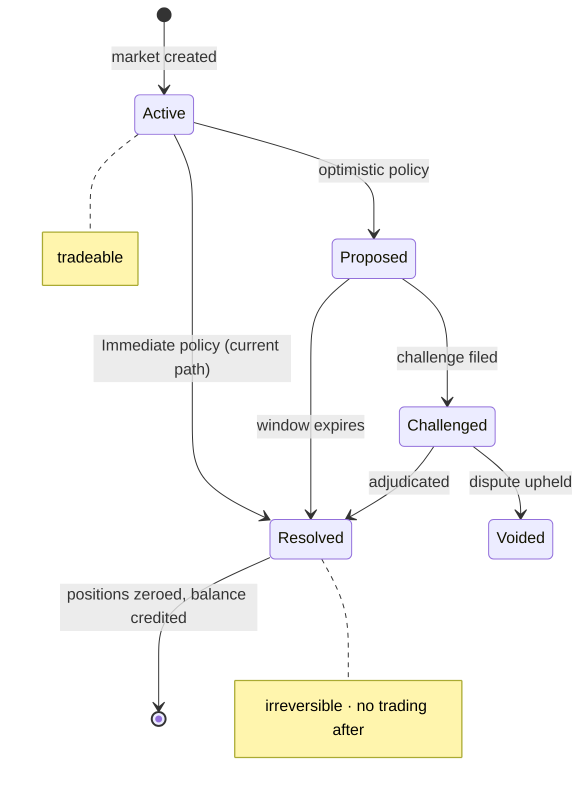

Market resolution is the moment a prediction market's question gets answered: YES shares pay out, NO shares pay the complement, and positions are converted to balance. The payout is specified in [[Nanos and Integer Arithmetic|nanos]]: YES shares receive `payout_nanos` per share, and NO shares receive `NANOS_PER_DOLLAR - payout_nanos` per share. For a standard binary resolution, `payout_nanos` is either `NANOS_PER_DOLLAR` (YES won) or 0 (NO won).

Fractional resolution is supported — `payout_nanos` can be any value between 0 and `NANOS_PER_DOLLAR`. This handles cases where the truth is partial: "Will the temperature exceed 100F?" might resolve 70/30 if the question was ambiguous or the outcome was disputed. The [[Oracle Lifecycle|oracle]] determines the payout value; the sequencer executes the settlement. Once resolved, the market's status transitions to `Resolved` and the decision is irreversible — positions cannot be traded after resolution, and the payout cannot be changed.

Resolution flows through the [[Block Lifecycle]]: when the oracle resolves a market, the sequencer includes the resolution in the next block, converting all holders' positions to balance credits. The [[Four-Layer Verification|verifier]] independently confirms that resolution payouts were applied correctly. The `ResolutionRecord` captures the immutable record: which market, what payout, which oracle source, and when.

Only the `Active -> Resolved` edge is live today under the `Immediate` policy; `Proposed`, `Challenged`, and `Voided` are the enum variants reserved for the optimistic/external policies on the [[Oracle System|oracle roadmap]]. Once a market reaches `Resolved` the payout is frozen — positions cannot be traded and the payout cannot change.

For a member of a mutually-exclusive [[Binary Markets and Market Groups|market group]], resolution removes only that market from the group. If at least two unresolved members remain, the group persists and the next solver problem and block witness still carry the survivor group, preserving the joint price and group-minting constraint over the remaining outcomes. If fewer than two members remain, the group dissolves because a singleton has no mutual-exclusion constraint left to enforce.

Resolved-market positions are zeroed during payout settlement before the next block is produced. Minting inputs are derived from account position totals, so the resolved market naturally drops out of future minting derivation while survivor markets remain governed by the shrunken group in the solver problem, state sidecar, and witness.

## Key Properties
- YES payout: `payout_nanos` per share
- NO payout: `NANOS_PER_DOLLAR - payout_nanos` per share
- Fractional resolution supported (e.g., 700,000,000 nanos = 70%)
- Resolution is irreversible — no trading after resolution
- `ResolutionRecord` captures immutable audit trail
- Payout validated within `[0, NANOS_PER_DOLLAR]`
- Multi-outcome groups shrink by the resolved member and dissolve only below two unresolved members

## Where This Lives
> `crates/sybil-oracle/src/types.rs` — `ResolutionRecord`, payout model
> `crates/matching-sequencer/src/settlement.rs` — resolution settlement logic

## See Also
- [[Oracle System]] — signed-attestation architecture, feeds + policies, full roadmap
- [[Oracle Lifecycle]] — current minimal state machine
- [[Settlement]] — the mechanics of position-to-balance conversion
- [[Binary Markets and Market Groups]] — the market structure being resolved
