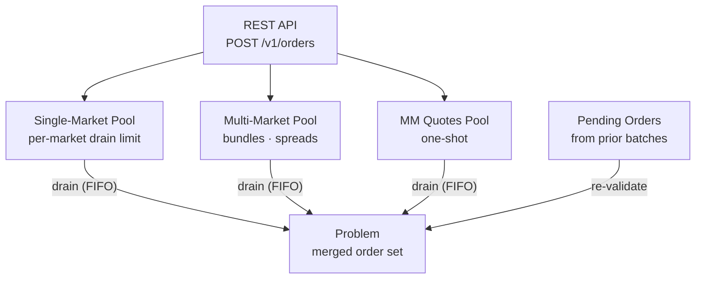

The mempool buffers incoming orders between batches. When the [[Block Lifecycle|1-second timer]] fires, the sequencer drains the mempool to assemble the next batch. Orders arrive via the [[REST API]] and are enqueued immediately without validation — validation happens at drain time, when the sequencer has the current state snapshot.

The mempool is segregated into pools by order type: single-market orders, multi-market orders (bundles, spreads), and MM quotes. Each pool has configurable drain limits that cap how many orders enter a single batch (see `mempool.rs` for current defaults). Within each pool, orders are drained FIFO — first in, first out. These limits prevent any single batch from becoming too large for the solver to handle within the batch interval.

MM quotes receive special treatment: they are one-shot. A market maker's quotes are consumed entirely by each batch and never carry over. This means MMs must re-submit fresh quotes every batch if they want to remain in the market. Regular trader orders that don't fill become [[Pending Orders and TTL|pending orders]] and persist for future batches. The segregated pool design ensures that a flood of one order type (say, a bot spamming single-market buys) doesn't crowd out other types from the batch.

## Key Properties
- Segregated pools: single-market, multi-market/bundle, MM quotes
- Configurable drain limits per pool type
- FIFO within each pool
- MM quotes are one-shot — never carried over to the next batch
- No validation at enqueue time — validated during drain
- Orders arrive from [[REST API]] endpoint `POST /v1/orders`

## Where This Lives
> `crates/matching-sequencer/src/mempool.rs` — pool segregation, drain limits, FIFO queues

## See Also
- [[Block Lifecycle]] — mempool drain is the first step
- [[Pending Orders and TTL]] — unfilled orders that bypass the mempool on re-inclusion
- [[REST API]] — how orders enter the mempool
