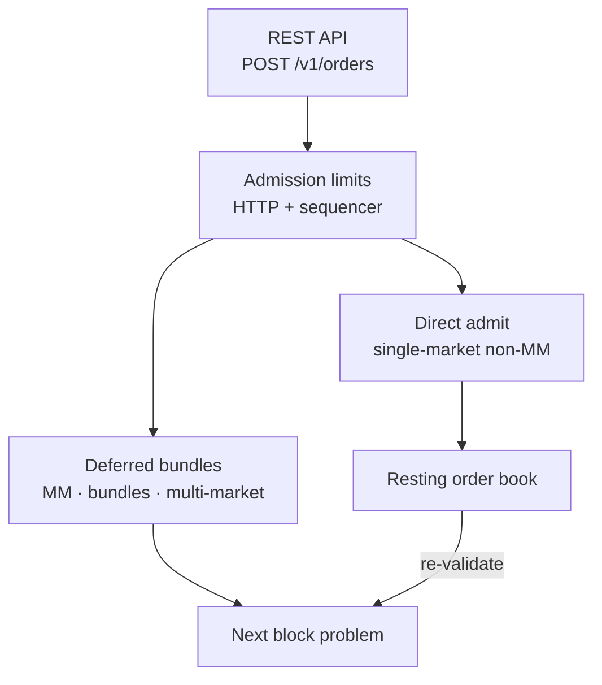

The old broad mempool has been narrowed into a deferred-submission buffer. Simple single-market, non-MM orders are admitted directly into the [[Pending Orders and TTL|resting order book]] at submission time, after validation and capital reservation. That makes them visible immediately and eligible for the next [[Block Lifecycle|block]] without waiting in an unvalidated queue.

Submissions that cannot be safely admitted one order at a time still use the deferred path: MM-constrained orders, multi-order bundles, and multi-market orders. They are durably appended to `PENDING_BUNDLES` and drained into the next block. This preserves batch-local semantics for flash liquidity, bundle atomicity, and group self-trade prevention.

Admission has lightweight backpressure before either path mutates state:

- HTTP order-write endpoints have a global and per-client token bucket before JSON parsing and P256 signature work.
- The sequencer actor has a global token bucket, bounding coordinated many-account submission floods.
- Each account has its own token bucket, bounding runaway agents without affecting normal users.
- Non-MM orders are capped per account across resting orders plus staged non-MM bundles.
- Deferred bundles have both total and per-account caps.
- A per-submission order-count cap prevents request amplification.

## Key Properties
- Simple single-market non-MM orders are validated, reserved, and visible immediately
- Deferred buffer is only for MM / bundle / multi-market submissions
- Deferred submissions are persisted before the API returns success
- MM quotes are one-shot — never carried over to the next batch
- Admission backpressure is generous by default and only affects abnormal load
- Orders arrive from [[REST API]] endpoints `POST /v1/orders` and `POST /v1/orders/signed`

## Where This Lives
> `crates/matching-sequencer/src/actor.rs` — admission limits and deferred-buffer routing
> `crates/matching-sequencer/src/sequencer.rs` — direct admit vs deferred submission decision
> `crates/matching-sequencer/src/store.rs` — `PENDING_BUNDLES` and admit-log persistence

## See Also
- [[Block Lifecycle]] — deferred submissions are merged at block production
- [[Pending Orders and TTL]] — unfilled orders that bypass the mempool on re-inclusion
- [[REST API]] — how orders enter the sequencer
