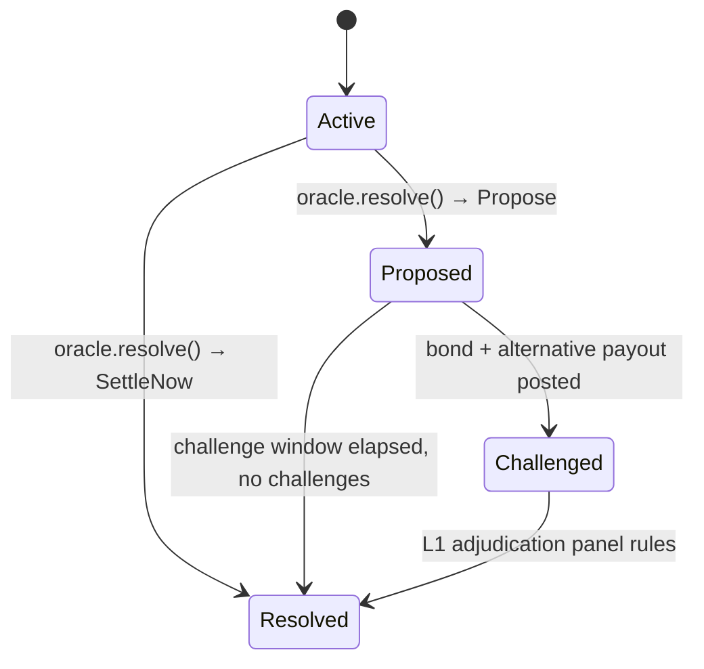

The oracle system determines when and how prediction markets resolve. It is a pluggable authorization layer: the oracle decides what happens (resolve now, propose with challenge window, reject), and the sequencer executes the decision. The oracle does not perform settlement, fetch external data, or handle bond escrow — it makes resolution decisions based on the information presented to it.

The lifecycle follows a state machine: **Active** → **Proposed** (with a challenge window) → either **Challenged** (escalated to L1 adjudication) or **Resolved** (unchallenged). An oracle can also bypass the proposal phase and resolve immediately (`SettleNow`) — the `AdminOracle` reference implementation does this for dev/testing. The challenge mechanism provides a safety net: if someone disagrees with a proposed resolution, they can post a bond and an alternative payout, escalating to a higher-tier adjudication process. L1 adjudication is a human panel that reviews the evidence and makes a binding resolution decision. Bond escrow is not handled by the oracle crate — it's a sequencer-side concern, since the oracle's role is purely to make resolution decisions.

Three oracle source tiers are defined. **Admin** (L0) is for dev mode and governance multisig — immediate resolution, no challenge window. **AutomatedL0** is for future price feeds and API oracles — automated data sources that can propose resolutions subject to challenge. **AdjudicationL1** is a human adjudication panel for disputed resolutions. The `Oracle` trait abstracts over all tiers: `resolve()` returns a `ResolutionAction` (SettleNow, Propose, or Reject), `challenge()` returns a `ChallengeAction` (Escalate or Reject), and `check_finalization()` determines whether a challenge window has elapsed without challenges.

## Key Properties
- State machine: Active → Proposed → Challenged/Resolved
- Oracle decides, sequencer executes — clean separation of concerns
- Three source tiers: Admin (dev), AutomatedL0 (feeds), AdjudicationL1 (human panel)
- Challenge mechanism with bond + alternative payout
- `Oracle` trait: `resolve()`, `challenge()`, `check_finalization()`
- Oracle does NOT settle, fetch data, or handle bonds

## Where This Lives
> `crates/sybil-oracle/src/traits.rs` — `Oracle` trait, `ResolutionAction`, `ChallengeAction`
> `crates/sybil-oracle/src/types.rs` — `MarketStatus`, `ResolutionProposal`, `Challenge`
> `crates/sybil-oracle/src/admin.rs` — `AdminOracle` reference implementation

## See Also
- [[Market Resolution]] — how resolution payouts are determined
- [[Settlement]] — the sequencer-side execution of resolution decisions
- [[Block Lifecycle]] — oracle resolutions integrated into block production
