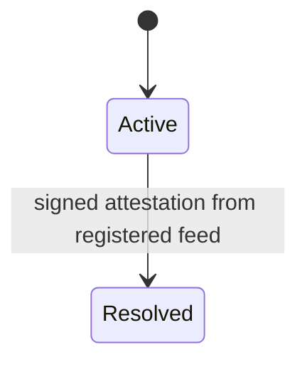

> **Full architecture and roadmap: [[Oracle System]].** This note captures the *current* (SYB-23) minimal state. The design doc is the source of truth for planned variants (Optimistic, Quorum, Predicate, External), bond escrow, liveness, and bridge feeds.

The oracle system determines when and how prediction markets resolve. A resolution is a signed attestation from a registered `DataFeed`, evaluated by the market's declared `ResolutionPolicy`. The sequencer verifies signatures and runs policy state-machine logic; all external I/O (Polymarket mirror, future LLM resolver, future UMA bridge) lives in untrusted signers whose only channel into the enclave is a signed attestation.

As of SYB-23 the only policy variant is `Immediate { feed_id }`: one attestation from the named feed settles the market with no challenge window. The `admin_immediate` template (default for markets without an explicit template) and the `polymarket_mirror` template (for Polymarket-mirrored markets) both use this variant.

State transitions today: `Active → Resolved`. The `Proposed`, `Challenged`, and `Voided` states are reserved — cost nothing, documented as future policy states for when `Optimistic` and `External` ship.

## Key Properties (SYB-23)
- State machine today: Active → Resolved
- Sequencer verifies signatures + runs policy; external signers do all I/O
- Shipped policy variants: `Immediate { feed_id }`
- Shipped templates: `admin_immediate`, `polymarket_mirror`
- Reserved states (`Proposed`, `Challenged`, `Voided`) and enum arms tracked in [[Oracle System]]

## Where This Lives
> `crates/sybil-oracle/src/{feed,attestation,policy,registry,template}.rs` — primitives
> `crates/sybil-oracle/src/traits.rs` — `Oracle` trait (legacy admin path)
> `crates/matching-sequencer/src/market_lifecycle.rs` — policy dispatch
> `crates/matching-sequencer/src/crypto.rs` — attestation sign/verify

## See Also
- [[Oracle System]] — full architecture, policy variants, deferred-feature migration path
- [[Market Resolution]] — how resolution payouts are determined
- [[Settlement]] — the sequencer-side execution of resolution decisions
- [[Block Lifecycle]] — oracle resolutions integrated into block production
- [[P256 Authentication]] — the shared sign/verify primitive
