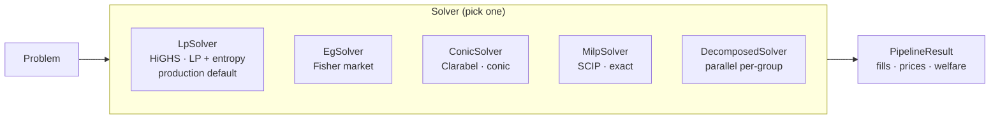

Sybil has five solver implementations, all sharing the same interface: take a `Problem`, return a `PipelineResult` containing fills, clearing prices, total welfare, and timing data. They differ in how they handle the [[MM Budget Constraint]] — the sole source of difficulty beyond the [[The LP Core|base LP]]. Each is feature-gated so you only compile what you need.

The [[LP Solver]] is the production default. It uses HiGHS to solve the core LP, adds entropy smoothing to break ties deterministically, and handles MM budgets via iterative SLP (Sequential Linear Programming) shading. It's the fastest solver and consistently achieves the highest welfare. The [[EG Solver]] reformulates the problem as a Fisher market using the Eisenberg-Gale objective, absorbing MM budgets into a log-utility function so they never appear as explicit constraints. Elegant but 13x slower than the LP solver. The [[Conic Solver]] uses Clarabel's interior-point method with three configurable objectives (Linear, Fisher, QuasiFisher); QuasiFisher adds a cash variable that prevents numerical blowup. The [[MILP Solver]] uses SCIP to solve the exact problem as a mixed-integer quadratically constrained program — guaranteed optimal but with a timeout for large instances. The [[Decomposed Solver]] partitions the problem by market group and solves each independently, coordinating MM budgets via mirror descent.

All solver outputs pass through the same [[Four-Layer Verification|verification pipeline]]. In comparative benchmarks, LP consistently achieves the highest welfare and fastest solve time. Conic (QuasiFisher) is close in welfare (~0.5% gap) at moderate speed cost. EG is significantly slower (~13x) with a small welfare gap (~2.4%). See `design/solver-benchmarks.md` for current numbers.

| Solver | Feature | Method | Speed | Welfare |
|--------|---------|--------|-------|---------|
| **LP** | `lp` | HiGHS + entropy + SLP | Fastest | Highest |
| **EG** | `lp` | Fisher/Eisenberg-Gale | 13x slower | -2.4% |
| **Conic** | `conic` | Clarabel interior-point | 1.7x slower | -0.5% |
| **MILP** | `milp` | SCIP MIQCQP | Timeout-bounded | Exact optimal |
| **Decomposed** | `lp` | Per-group + mirror descent | Varies | -7% |

## Where This Lives
> `crates/matching-solver/src/` — all solver implementations
> `design/solver-benchmarks.md` — comparative benchmarks

## See Also
- [[LP Solver]] — production default, start here
- [[MM Budget Constraint]] — the problem each solver handles differently
- [[The LP Core]] — the easy base problem all solvers share
