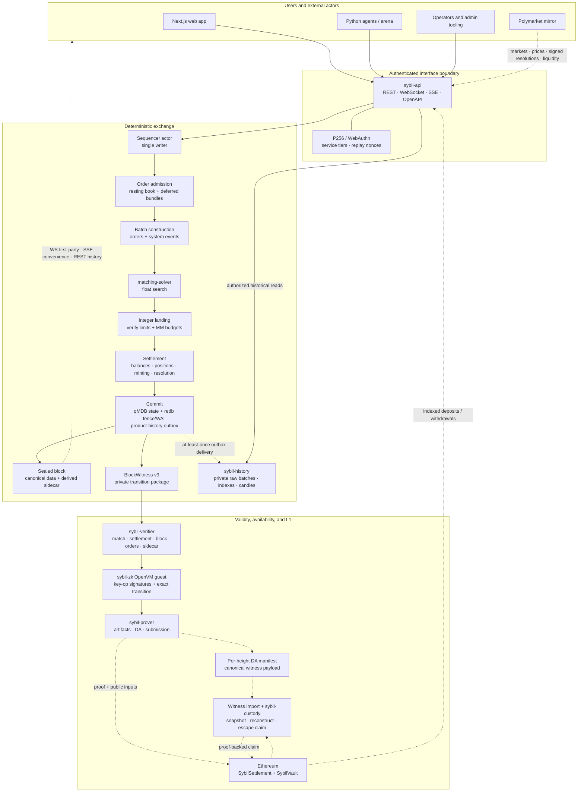
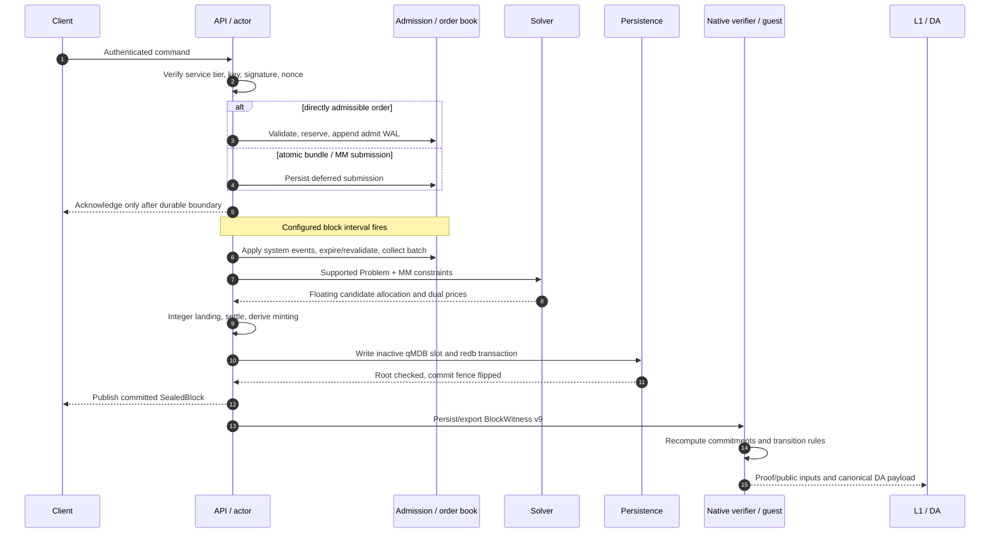

# Sybil architecture

> [!summary] Executive summary
> Sybil is a verifiable prediction-market exchange. Orders are admitted durably, cleared together in frequent batch auctions, settled with deterministic integer arithmetic, and committed in a hash-chained block. Each block carries a private witness from which native code and an OpenVM guest re-derive the transition. Ethereum holds collateral and accepted roots; published witness/DA material supports auditing, recovery, and the evolving escape path. Humans, bots, the web app, and external mirrors all use the same authenticated API boundary.

This is the map of the architecture vault. For the most approachable explanation, start with the [Documentation & Architecture Guide](../README.md). For a linear implementation walkthrough, read [the system specification](../SPEC.md). The implementation and current verification tests remain the final source of truth.

For compilation and ownership boundaries, see [[Crate Dependency Map]].

## The whole system

Solid arrows are trusted state-transition calls. Dashed arrows are asynchronous publication, external observation, or recovery paths.

The load-bearing boundary is **untrusted search and external input outside; authenticated integer state inside**. Solvers may search with floating point, feeds may be wrong, and clients may be hostile. Only validated integer fills, replayed settlement, canonical bytes, and committed roots become protocol truth.

## One block, end to end

If persistence fails, the prepared state is discarded and acknowledged inputs remain replayable. The actor publishes only after the fence names the committed qMDB slot.

## Decisions that shape the design

| Decision | Intuition | Architectural consequence |
|---|---|---|
| Frequent batch auctions | Compete on price, not microseconds | All eligible orders in a block clear together at uniform prices |
| Welfare over volume | Allocate scarce liquidity where it creates the most surplus | Zero-surplus marginal orders need not fill |
| Payoff-vector domain model | Give order shapes one mathematical representation | The model can express more than production clearing; unsupported shapes are rejected at every boundary |
| Float search, integer truth | Use numerical solvers without trusting their machine-specific arithmetic | Only landed integer fills/prices reach settlement and proofs |
| Actor around a synchronous kernel | Make mutation order explicit | Exchange state has one writer; concurrency stays at the boundary |
| WAL plus single commit fence | A successful acknowledgement must survive a crash | Persist before live mutation/publication; recovery follows the fence, never “newest wins” |
| Canonical block, witness, derived sidecar | Validity and product consumers need different data | Analytics stay outside roots; the witness remains transition-complete |
| Verifier-owned bytes | Soundness cannot depend on hand-synchronized encoders | Native, guest, state, event, witness, and signing domains have explicit owners and vectors |
| State-bound P256/WebAuthn key mutations | The active signing-key set must change only with user authority | Key operations and their signatures are committed and checked in the guest |
| Genesis-bound ordinary signed actions | Captured orders/cancels must not cross chain domains | Admission verifies signatures and durable monotonic nonces; ordinary envelopes are not yet guest-proven |
| Validium with two exit paths | Correctness, availability, and recovery are different problems | Proofs anchor roots; DA enables reconstruction; escape claims provide a conservative cash floor |

## Current versus forward-looking

The vault frontmatter is authoritative about document status: `current` means implemented/current behavior; `planned` means a design or partially landed path whose production trust story is incomplete.

### Current foundations

- Single-market binary clearing, seven solver entry types (including two legacy
  aliases), one trusted verifier, and one net-of-minting welfare definition.
- Direct admission plus deferred atomic submissions, resting reservations, deterministic settlement, and group-preserving resolution.
- redb/qMDB fence-based persistence, acknowledged-write replay, a private
  history projector behind a transactional outbox, backup/restore, witness
  import, and user-side custody/reconstruction/escape tooling.
- WebAuthn/P256 admission, durable per-account replay nonces, and committed/in-guest-verified key operations. Ordinary order/cancel envelopes are not yet guest-proven.
- Witness v9, committed last clearing prices, deposit quarantine, exact-keyspace proofs, and guest/native commitment agreement.
- REST, resumable WebSocket, convenience SSE, OpenAPI, shared Rust client, Python agents, and the Polymarket integration.

### Still incomplete as a production trust system

- Production prover/adapter deployment and operations remain distinct from local proof and contract integration.
- Provider-backed DA retention, emergency disclosure policy, and governance for hostile-operator replacement remain planned.
- The L1 escape/replacement path is intentionally conservative; cash escape does not magically unwind prediction-market positions.
- Oracle core policy remains immediate signed-feed resolution; richer challenge/adjudication behavior lives outside or ahead of the core policy.

## Vault map

### 01 — Foundations

Start here for the economic and numeric model: [[Frequent Batch Auctions]], [[Binary Markets and Market Groups]], [[Payoff Vectors]], [[Order Types]], [[Welfare Maximization]], [[Welfare vs Volume]], [[Minting]], [[Nanos and Integer Arithmetic]], and [[Fractional Quantities]].

### 02 — Matching

Read [[Solver Landscape]] first, then [[The LP Core]], [[MM Budget Constraint]],
[[Retained Cash Solver]], [[LP Duality and Clearing Prices]], [[EG Solver]],
[[Conic Solver]], and [[MILP Solver]].

### 03 — Sequencing and persistence

The connected path is [[Order Admission]] → [[Pending Orders and TTL]] → [[Block Lifecycle]] → [[Settlement]] → [[Persistence]]. Supporting detail: [[Acknowledged-Write WAL Replay]], [[Block Data Boundaries]], [[Historical Data Serving]], [[Fill History Persistence]], [[Actor Mailbox Monitoring]], and [[Testing Strategy]].

### 04 — Verification, ZK, and recovery

Read [[Threat Model]] first. Then follow [[Block Witness]], [[Four-Layer Verification]], [[Canonical Serialization]], [[State Root Schema]], [[State Root and Parent Hash]], [[Proof Architecture]], [[ZK Integration Path]], [[Data Availability]], [[L1 Settlement and Vault]], and [[Operator Replacement]].

### 05 — Interfaces and resolution

See [[REST API]], [[P256 Authentication]], [[Attestation]], [[WebSocket Block Stream]], [[SSE Block Stream]], and [[Market Resolution]].

### 06 — Agents

See [[Python SDK]], [[Bot Framework]], and [[LLM Trader]].

### 07 — Operations

See [[Deployment Profiles]], plus the runbooks linked from the [documentation guide](../README.md).

## Reading paths

- **Five-minute orientation:** this page, then the [Documentation & Architecture Guide](../README.md).
- **Change matching/economics:** [[Welfare Maximization]] → [[The LP Core]] → [[Solver Landscape]].
- **Change block/state behavior:** [[Block Lifecycle]] → [[Persistence]] → [[State Root Schema]] → [[Testing Strategy]].
- **Change validity-critical code:** [[Threat Model]] → [[Block Witness]] → [[Four-Layer Verification]] → the relevant ADR.
- **Change an API/client:** [[REST API]] → [[P256 Authentication]] → the relevant realtime or agent note.
- **Operate or recover:** [[Deployment Profiles]] → [[Data Availability]] → [[Operator Replacement]] → `docs/runbooks/`.

## Documentation contract

- Architecture notes explain intuition, boundaries, and invariants; code owns exhaustive field-level truth.
- Current and planned behavior must be visibly separated.
- Historical proposals belong in `design/` or version-control history, not mixed into current architecture prose.
- Byte/witness/key/state format changes update the owning note and golden tests in the same change.
- Significant architecture changes update this map, the relevant ADR/note, and `docs/SPEC.md`, then run `just docs-check` and `just docs-build`.
