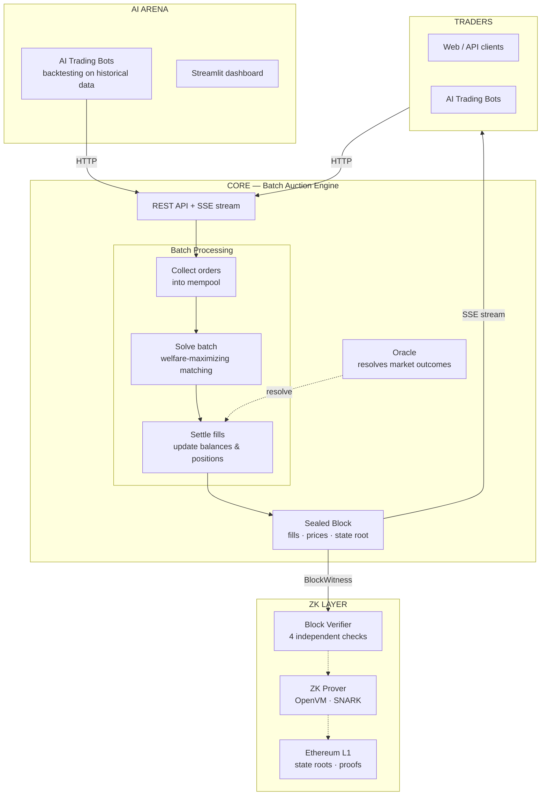

Sybil is a prediction market matching engine built on Frequent Batch Auctions. Traders place orders on binary-outcome markets — "Will X happen? YES or NO" — and every second, all pending orders are batched together and cleared simultaneously by a welfare-maximizing solver. This is fundamentally different from continuous limit order books: instead of a race to be first, every participant in a batch gets the same price. The architecture is designed from the ground up for verifiability, with a ZK proof pipeline that can attest to the correctness of every batch on-chain.

The system is organized into three layers. The **core exchange** handles order collection, batch solving, settlement, and block production. It's built in Rust with all-integer arithmetic (no floating point) to ensure deterministic, ZK-friendly computation. The **AI arena** is a Python layer where trading bots compete against each other, connected via an HTTP API and SSE block stream. The **ZK layer** verifies blocks across four independent checks and is designed to compile into SNARK circuits for on-chain proof posting.

The matching problem itself has an elegant mathematical structure: without market maker budget constraints, it's a simple linear program solvable in milliseconds. The sole source of NP-hardness is the bilinear coupling between clearing prices (dual variables) and fill quantities (primal variables) in MM budget constraints — but since there are only 2-10 market makers, this is tractable via specialized decomposition methods.

## Core Concepts
- [[Frequent Batch Auctions]] — simultaneous clearing every second, no speed advantage
- [[Payoff Vectors]] — unified order representation as vectors over world states
- [[Welfare Maximization]] — maximizing total consumer surplus, not volume
- [[Nanos and Integer Arithmetic]] — the numeric foundation
- [[Binary Markets and Market Groups]] — binary outcomes grouped for multi-outcome events
- [[Minting]] — share creation mechanics
- [[Fractional Quantities]] — fixed-point share units

## The Matching Problem
- [[The LP Core]] — the polynomial-time base problem
- [[MM Budget Constraint]] — the sole source of NP-hardness
- [[LP Duality and Clearing Prices]] — prices as dual variables
- [[Welfare vs Volume]] — why we maximize welfare, not trades

## Solvers
- [[Solver Landscape]] — overview of all five solvers
- [[LP Solver]] — production default (HiGHS)
- [[EG Solver]] — Fisher market formulation
- [[Conic Solver]] — interior-point via Clarabel
- [[MILP Solver]] — exact optimal via SCIP
- [[Decomposed Solver]] — parallel per-group solving

## Block Production and Verification
- [[Block Lifecycle]] — from order submission to sealed block
- [[Mempool]] — order buffering and drain limits
- [[Actor Mailbox Monitoring]] — queue-depth observability for hot actors
- [[Settlement]] — balance and position updates
- [[Pending Orders and TTL]] — cross-batch order persistence
- [[Persistence]] — crash recovery and acknowledged-write durability
- [[Historical Data Serving]] — durable block and price history design
- [[Testing Strategy]] — layered fixtures, restart tests, and property tests
- [[State Root and Parent Hash]] — cryptographic chaining
- [[Block Witness]] — the ZK audit trail
- [[Four-Layer Verification]] — 37 independent correctness checks across 4 layers
- [[Proof Architecture]] — authenticated data for arbitrary account-level proofs
- [[ZK Integration Path]] — the road to on-chain proofs
- [[Data Availability]] — provider-neutral validium payload commitments
- [[L1 Settlement and Vault]] — Ethereum custody, root acceptance, withdrawals, and escape boundaries

## API and Oracle
- [[REST API]] — HTTP endpoints for trading
- [[Order Types]] — from simple buys to custom payoff vectors
- [[P256 Authentication]] — cryptographic order signing
- [[SSE Block Stream]] — real-time block push
- [[Oracle Lifecycle]] — market resolution process
- [[Market Resolution]] — outcome determination and payout

## Operations and Deployment
- [[Deployment Profiles]] — local/devnet/prod knob matrix, durability guardrails, and history-serving policy
- [[Acknowledged-Write WAL Replay]] — WAL table inventory, replay-order dependency matrix, and the single-sequenced-WAL decision record

## Arena and Development
- [[Python SDK]] — async client library
- [[Bot Framework]] — building trading agents
- [[LLM Trader]] — AI-powered trading decisions
- [[Crate Dependency Map]] — how the Rust crates connect
