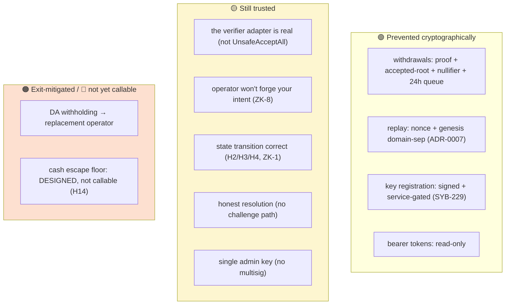

# Threat Model

Sybil's pitch is **trust minimization**: your *cash* has a cryptographic floor
(the escape claim), and your *positions* survive operator failure (operator
replacement, [ADR-0005](../adr/0005-escape-via-operator-replacement.md)). This
note is the honest map of how close the *implementation* is to that goal — what
is cryptographically prevented today, what you still trust, and the sequenced
path to closing the gap.

It is **adversary-framed** and complements the code review (which is
finding-framed): where a claim rests on a review finding, it cites
`docs/review/{14,15,01}` rather than re-deriving. Several 2026-07-02 review
findings have since been fixed (SYB-224/229/231, H6, H12) — those are marked.

**Status legend.** 🟢 **CRYPTO** — cryptographically prevented · 🟡 **TRUSTED** —
currently relied upon · 🟠 **ESCAPE** — mitigated only by the exit path · 🔴
**GAP** — unmitigated today.

## Assets at stake
Collateral (cash in the vault) · open positions · **state integrity** (the root
means what it says) · **liveness** (blocks keep being produced) · **resolution
correctness** (markets settle to the true outcome).

---

## 1. Malicious / compromised operator — the dominant surface

| Attack | Status | Where it stands |
|---|---|---|
| Steal collateral via withdrawal | 🟢 / 🟡 | `requestWithdrawal` requires `isAcceptedRoot` + nullifier + `verifier.verify` (`SybilVault.sol`) + 24h queue. **CRYPTO if the deployed adapter is real; TRUSTED while `UnsafeAcceptAllVerifierAdapter` is wired (devnet).** |
| Forge a state transition | 🔴 | Root acceptance is now verifier-gated (`SybilSettlement.sol`, past the review's H1 era), but the **guest is not yet adversarially sound**: fill→account binding (H2), unchecked arithmetic (H3), sidecar transition (H4), digest updates (ZK-1). A "verified" root can still attest invalid state until these close. |
| **Forge *your* intent** | 🔴 | **ZK-8 — the under-appreciated one.** Signatures are checked at ingress (`actor.rs verify_signed_order`) but **not inside the guest**, so a valid proof attests a *balance-conserving* batch, not a *user-authorized* one. The operator could place or cancel orders in your name under a fully valid proof. The fix path is in-guest signature verification, whose primitive lands with [ADR-0008](../adr/0008-in-guest-p256-openvm-ecc.md) (SYB-225). |
| Equivocate (two blocks at one height) | 🔴 | Guest accepts `new_height ≤ prev`; settlement doesn't enforce `height == prev+1` (ZK-3). Weak anti-equivocation. |
| Credit unbacked deposits | 🔴 | Guest never verifies deposit-leaf inclusion (H5, dead Merkle path). Contract-side H6 (zero-root) **fixed**; guest-side inclusion still open. |
| Withhold data (DA) | 🟠 | Positions recoverable only from published witnesses or the user-held custody snapshot (Form L leaf proofs). DA is a **liveness assumption** for replacement-operator continuity. → [[Data Availability]], [[Operator Replacement]] |

## 2. Malicious user / trader — best-defended layer

| Attack | Status | Where |
|---|---|---|
| Replay | 🟢 | Per-account strictly-increasing nonce + genesis-hash domain separation ([ADR-0007](../adr/0007-canonical-bytes-domain-separation.md), SYB-224/231). Supersedes review D3. |
| Unauthorized key registration | 🟢 | SYB-229 closed the public unsigned `POST /keys` account-takeover primitive; now signed + service-gated. |
| Forged signature / account spoofing | 🟢 | P256 over domain-separated canonical bytes; cross-action confusion closed by distinct domain strings. (Note: not re-checked in-guest — see ZK-8 above.) |
| Over-withdrawal / double-escape | 🟢 | Nullifier map + one-claim-per-account-per-root freshness (ADR-0005). |
| Grief the solver (pathological orders) | 🔴 | Multi-market/custom-payoff orders accepted end-to-end and mis-modeled; no `max_fill` cap (C1/C2/D4). Enforcement is API-layer only — a value-leak, not just DoS. → [[Order Types]] |

## 3. Malicious oracle / resolver

Resolution is a registered feed's P256 attestation evaluated by
`ResolutionPolicy::Immediate` — effectively 🟡 **TRUSTED**. No propose/challenge
is wired (Quorum/Optimistic/Predicate are reserved arms, OL-5). A dishonest
resolver can pick winners; there is no bond or challenge window. Latent 🔴: OL-2
(`evaluate_immediate` doesn't assert `attestation.market_id == market_id`), OL-6
(signed `nonce` vestigial). → [[Oracle System]], [[Market Resolution]]

## 4. Malicious solver

Outside the trust boundary *by intent*: fills are witness data the verifier
independently re-derives via **shared pure settlement functions**. But the
independence is weaker than it looks — the native Layer-3 check is *circular*
(the sequencer writes the root and re-checks it with the same function, ZK-5);
genuine differential independence exists only in the **guest** path, which today
runs only in smoke tests, not fail-closed in production. So a mis-clearing is
caught *in principle* but 🟡 **TRUSTED-leaning** at runtime until guest
verification gates production. → [ADR-0001](../adr/0001-eg-fisher-market-matching.md)

## 5. L1 / bridge adversary

- Deposit races / reorgs: 🟢 **fixed** (H12) — confirmation depth
  (`SYBIL_L1_CONFIRMATIONS`, raise to 12–32 for real value), per-id
  `depositRootByCount` reconciliation, persistent cursor.
- **Cash escape floor: 🔴 designed, not callable (H14).** `activateEscapeMode` is
  a flag only; no `escapeClaim` entrypoint yet. The pause carve-out and
  newest-root freshness (ADR-0005) are specified (SYB-32), not coded. This is the
  headline gap between the *pitch* and *today*.
- Verifier-adapter pin: 🟡 admin + 48h timelock (`OP_SET_VERIFIER`). → [[L1 Settlement and Vault]]

## 6. Infrastructure / key management

Single admin key on both contracts, **no multisig** (immediate `pause` /
`cancelWithdrawal`; 48h-timelocked param/verifier/admin changes) — 🟡 a single
point of custody. Residual 🔴: the committed OpenRouter key (SYB-230) — removed
from tree, rotation + history purge pending. Bearer tokens: 🟢 read-only.

---

## The honest list: what you still trust the operator for

1. **That the deployed verifier adapter is real**, not `UnsafeAcceptAll` — else
   all withdrawal/root gating is theater. *(Flip this first for any real value.)*
2. **Not to forge your intent** (ZK-8) — under a valid proof the operator can act
   in your name.
3. **A correct state transition** — until H2/H3/H4/ZK-1 close and guest
   verification is fail-closed in prod.
4. **That deposits are backed** (H5) — until the guest verifies deposit inclusion.
5. **That you can actually exit** (H14) — the cash floor is designed but not yet
   callable.
6. **Honest resolution** — single trusted feed, no challenge.
7. **Custody of one admin key** — no multisig.

## The path to trust-minimization (sequenced)

Each item flips a 🟡/🔴 above to 🟢. Rough order by leverage:

1. **Deploy the real verifier adapter** (retire `UnsafeAcceptAll`) — flips #1;
   nothing else matters without it.
2. **Guest soundness**: close H2/H3/H4/ZK-1 and run guest verification
   **fail-closed in production** — flips #3, and makes #4 (H5 deposit inclusion)
   meaningful.
3. **Ship the escape entrypoint** (SYB-32) + the `keys_digest` prerequisite
   (SYB-225, [ADR-0008](../adr/0008-in-guest-p256-openvm-ecc.md)) — flips #5.
4. **In-guest intent verification** (ZK-8) — verify order/cancel signatures in the
   guest, using the P-256 primitive #3 introduces — flips #2. *(Larger scope, but
   the primitive is the same.)*
5. **Anti-equivocation**: enforce `height == prev+1` and bind `witness_root` in
   the header (ZK-3).
6. **Resolution challenge path** (oracle propose/challenge, OL-5) — flips #6.
7. **Admin multisig / timelock hardening** — flips #7.

Items 2–3 ride the **fresh-genesis redeploy**
([ADR-0009](../adr/0009-fresh-genesis-for-consensus-changes.md)); the escape
work (3) is the most user-visible promise to make real. Until then, be precise in
external messaging about which guarantees are *cryptographic* today versus
*roadmapped* — the [review](../review/00-executive-summary.md) tree is the ground
truth.
