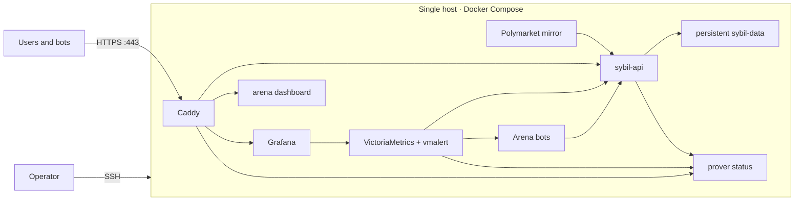

# Deployment and operations

> **Executive summary:** [`DEPLOY.md`](https://github.com/MetaB0y/sybil/blob/main/DEPLOY.md) is the single authoritative
> remote deployment runbook. This page is the documentation-site index: it
> explains the topology at a glance and routes operators to the procedure they
> need without duplicating commands, ports, or credentials.

## Deployed shape

Prelaunch is one Docker Compose stack on a single host. Caddy is the only
public listener; the API, prover, dashboards, metrics, mirror, and arena are
reachable only on the Docker network. The locked prelaunch startup fails
closed when required secrets or persistence settings are missing.

The Arena exporter publishes runner-owned desired state (configured traders),
market selection, news-feed health, and LLM usage. `sybil-api` separately reads
the shared decisions database for observed per-trader activity. vmalert joins
those two sources by trader name so retired historical traders do not page while
a configured trader that stalls or never starts still does.

The checked-in Compose files and `justfile` are executable truth. Never copy a
port, credential, or environment-variable list from an old incident report or
design document.

## Choose the right procedure

| Task | Source of truth |
|---|---|
| Normal deploy, secrets, smoke checks, logs | [`DEPLOY.md`](https://github.com/MetaB0y/sybil/blob/main/DEPLOY.md) |
| Deployment profiles and trust posture | [[Deployment Profiles]] |
| Validity-breaking devnet redeploy | [Fresh-genesis redeploy](runbooks/fresh-genesis-redeploy.md) |
| Backup and restore drill | [Store backup and restore](runbooks/store-backup-restore.md) |
| Synthetic checks and alert delivery | [Synthetic monitoring](runbooks/synthetic-monitoring.md) |
| Block-production latency incident | [Block-production latency](runbooks/block-production-latency.md) |
| Contract authority and key rotation | [Admin keys](runbooks/admin-keys.md) |

## Non-negotiable locked-stack checks

Before operating prelaunch or a future real-value deployment:

1. Use `docker-compose.prod.yml`; do not copy the local override to the host.
2. Keep every service except Caddy off public host ports.
3. Supply the service token, Grafana password, Caddy operations credentials,
   WebAuthn RP/origin values, and arena provider key through host-side env files.
4. Run the post-deploy smoke checks from `DEPLOY.md`.
5. Confirm persistent storage, backup/restore, alert delivery, and proof/DA
   posture appropriate to the value at risk.

This page intentionally omits literal secret names and host-specific values
where the root runbook already owns them. One deploy procedure is easier to
audit than two almost-identical ones.
