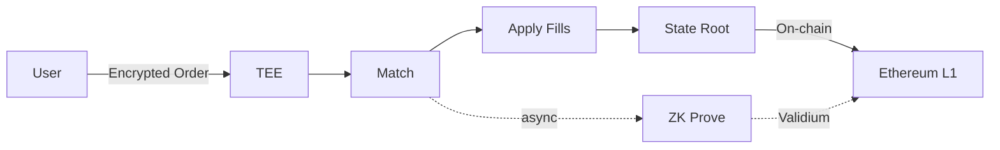

# How Sybil Works

Sybil combines three key innovations:

1. **Private Batch Auctions** — Orders accumulate privately, then clear at a fair price
2. **TEE + ZK Architecture** — Real privacy with cryptographic verification
3. **Welfare-Maximizing Matching** — Optimal price discovery across all orders

## The Batch Auction Cycle

Every batch follows the same cycle:

<Steps>
  <Step title="Order Submission">
    Users submit encrypted orders to the sequencer. Orders are stored privately inside a Trusted Execution Environment (TEE). **Nobody can see your order** — not other traders, not even Sybil operators.
  </Step>
  <Step title="Matching">
    The matching engine runs inside the TEE. It finds the **welfare-maximizing** allocation — the set of fills that creates the most total surplus. All matched orders execute at the same clearing price. Results are applied immediately — users see their fills right away.
  </Step>
  <Step title="Settlement">
    The batch result (clearing prices, volume, state root) is posted on-chain. Data stays off-chain (validium), state roots live on-chain.
  </Step>
  <Step title="ZK Proof (Background)">
    A zero-knowledge proof is generated asynchronously proving:
    - The matching was correct
    - All trades satisfy limit prices
    - Balances are conserved
    - State transition is valid

    Proofs are posted on-chain once ready. Users don't wait for proofs — they can trade immediately in the next batch.
  </Step>
</Steps>

## Privacy Architecture

| Data | Visibility |
|------|------------|
| Individual trades | **Private** — encrypted in TEE |
| User balances & positions | **Private** — only you can see |
| Clearing prices & volume | Public — fair for everyone |

The TEE could theoretically censor orders (not include them), but it **cannot** cheat on execution — that's ZK-proven. Censorship is detectable and attributable. See [Privacy Architecture](/technical/privacy) for the full trust model.

## Welfare-Maximizing Matching

Unlike traditional exchanges, Sybil finds the **optimal** set of fills — the combination that creates the most total surplus for all participants.

| Priority Method | Who Wins | Efficiency |
|-----------------|----------|------------|
| FCFS (speed) | Fastest bots | Low — speed competition wastes resources |
| Tips (Likely, etc.) | Highest payers | Medium — leaves money on the table |
| **Welfare optimization** | Best prices | **Maximum** — mathematically optimal |

See [Matching Engine](/technical/matching-engine) for the full pipeline.

## Built-In Arbitrage

This is one of Sybil's most important innovations — and it's only possible with batch auctions.

### The Problem with CLOBs

On a continuous limit order book (CLOB), when prices across related markets are inconsistent, **arbitrageurs** step in:

1. They spot the inconsistency
2. They race to exploit it (latency competition)
3. They extract the profit for themselves
4. Users get worse prices — the arb profit came from somewhere

Arbitrageurs are a **tax on the market**. They're necessary on CLOBs to keep prices consistent, but they extract value from regular traders and market makers.

### How Sybil Eliminates This

In Sybil's batch auction, arbitrage is **built into the matching engine**. The engine itself detects and resolves price inconsistencies:

1. **Finds clearing prices** for each market independently
2. **Detects cross-market inconsistencies** — prices that don't add up
3. **Creates additional fills** that fix the inconsistency — matching more orders and improving prices
4. **Allocates MM budgets** optimally across markets

<Info>
**No one profits from the arbitrage.** Instead of an arb bot extracting value, the engine uses the opportunity to fill more orders at better prices. The value goes to users, not bots.
</Info>

### Example

An election has three candidates. After initial price discovery:

| Market | Price |
|--------|-------|
| "A wins" | 45% |
| "B wins" | 35% |
| "C wins" | 15% |
| **Total** | **95%** |

Prices sum to 95%, not 100%. On a CLOB, an arbitrageur would buy all three at \$0.95, guaranteed \$1.00 payout, pocketing \$0.05.

**On Sybil**: The engine detects this gap and uses it to match additional orders — buyers who were slightly outside the clearing price now get filled. More trades happen, prices converge to 100%, and the surplus goes to traders, not bots.

### Why This Only Works with FBA

| Feature | CLOB | FBA (Sybil) |
|---------|------|-------------|
| Price inconsistency | Arb bots race to exploit | **Engine resolves automatically** |
| Who profits | Arb bots | **Users (more fills, better prices)** |
| Speed required | Microseconds | None |
| Value extraction | Parasitic | **Zero** |
| Cross-market consistency | Eventually (after arb) | **Immediately (in same batch)** |

A CLOB can't do this because orders execute sequentially — by the time you see the inconsistency, someone already exploited it. In a batch auction, all orders are processed together, so the engine can find the globally optimal solution.

## Collateral & Yield

Your collateral is held in **sUSDS** — a yield-bearing stablecoin (~4% APY). Your capital earns yield while you trade, making long-dated markets viable.

## Selective Reputation

Privacy is the default, but you can **choose** to reveal information via ZK proofs — prove your track record, Sharpe ratio, or ranking without revealing your actual trades. See [Privacy Architecture](/technical/privacy#selective-disclosure) for details.

## Why This Wasn't Possible Before

<Info>
This architecture wasn't buildable a few years ago. What changed:

- **ZK proving costs dropped 10-100x** — real-time proving is now feasible
- **TEE tooling matured** — easier to deploy, easier to verify
- **Validium economics work** — data off-chain, proofs on-chain
- **Welfare optimization** is tractable — advances in matching algorithms
</Info>

## Next Steps

<CardGroup cols={2}>
  <Card title="Core Concepts" icon="book" href="/core-concepts">
    Learn the key terminology
  </Card>
  <Card title="Order Types" icon="list" href="/trading/order-types">
    Understand how to trade
  </Card>
</CardGroup>
