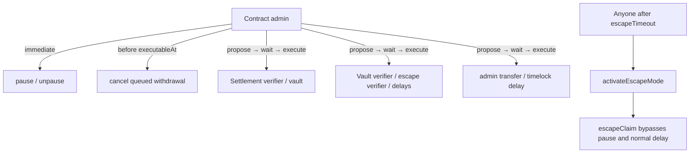

# Contract administrator and verifier keys

> **Executive summary:** `SybilSettlement` and `SybilVault` each have one
> administrator. Pause/unpause and withdrawal cancellation are immediate;
> verifier, vault, timing, and administrator changes use the contracts'
> proposal timelock. Escape activation itself is permissionless after the
> liveness timeout, and escape claims deliberately bypass pause.

The contract constructors choose the administrator and all delay values. Do
not infer a deployment's actual addresses or delays from test constants or this
runbook: query the deployed contracts before acting.

## Authority map

Both contracts inherit `contracts/src/access/SybilAccessControl.sol`. There are
no separate pauser, guardian, or verifier-administrator roles.

## Immediate administrator actions

- `pause()` and `unpause()` on either contract.
- `cancelProposal(id)` for a pending timelock proposal.
- `SybilVault.cancelWithdrawal(nullifier, reason)` only while a normal
  withdrawal is queued and before its `executableAt` time. Cancellation releases
  the nullifier so the user can request again.

Pausing the vault blocks deposits and normal withdrawal request/finalization.
It does **not** block `escapeClaim`; that exception is part of the recovery
model. Pausing settlement blocks new root acceptance.

## Timelocked actions

Every change requires an exact proposal for the same operation and ABI-encoded
arguments, followed by execution after `adminActionDelay`:

| Contract | Operation |
|---|---|
| Settlement | `OP_SET_VERIFIER`, `OP_SET_VAULT` after the initial vault assignment |
| Vault | `OP_SET_VERIFIER`, `OP_SET_ESCAPE_VERIFIER`, `OP_SET_WITHDRAWAL_DELAY`, `OP_SET_ESCAPE_TIMEOUT` |
| Both | `OP_ADMIN_TRANSFER`, `OP_ADMIN_ACTION_DELAY` |

`verifier` and `escapeVerifier` are separate trust pins. Rotating the normal
transition verifier does not rotate the escape guest verifier.

## Before proposing a change

1. Query `admin`, `adminActionDelay`, the current verifier/vault addresses, and
   the relevant delay from the deployed contracts.
2. Verify the new adapter's chain, address, guest commitments, and underlying
   verifier implementation independently.
3. Compute and record the proposal id, operation, encoded arguments, data hash,
   and `executableAt`.
4. Have a second operator compare those values with the intended artifact.
5. After execution, read the contract state back and exercise the affected path.

## Custody and loss

The repository does not define who personally holds a live deployment key.
Record that in the private operator inventory, not public documentation. Before
real-value deployment, use hardware-backed or multisig custody appropriate to
the value at risk and rehearse the timelocked transfer.

Loss of the sole administrator removes the incident brake and all upgrade/
parameter authority. Normal permissionless withdrawal finalization and
timeout-triggered escape activation remain available, but no operator can pause,
cancel a suspicious queued withdrawal, or rotate a verifier.

Implementation truth: `SybilAccessControl.sol`, `SybilSettlement.sol`, and
`SybilVault.sol`. See [[L1 Settlement and Vault]] and [[Threat Model]].
