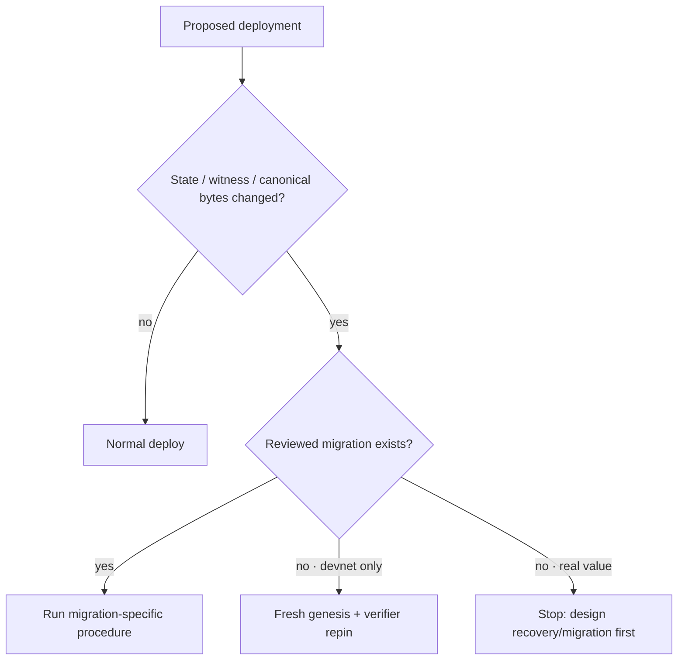

# Fresh-genesis redeploy

> **Executive summary:** use a fresh genesis when a validity-critical schema or
> guest commitment changes and no explicit migration exists. This is a
> destructive devnet procedure: preserve evidence, repin both verifier paths as
> needed, reset state, deploy one exact revision, and verify the new chain from
> browser to proof artifacts. Never use this procedure to discard real user
> funds or avoid a migration decision.

Routine application, frontend, bot, and monitoring changes use the normal
commands in the root `DEPLOY.md`. A fresh genesis is appropriate only when the
old persisted state cannot be interpreted by the target revision, or when the
accepted-root chain intentionally restarts under new validity commitments.

## Decision gate



Signals that require explicit review include changes to state-root leaves,
canonical encodings, signing domains, `BlockWitness`, public inputs, guest
dependencies, withdrawal/escape claim schemas, or the L1 verifier adapters.

`just check-consensus` enforces the decision mechanically. It fingerprints the
canonical golden vectors, desired verifier pins, both guest source/commitment
locks, and the resolved Commonware packages in `Cargo.lock`, then requires
`deploy/validity-boundary.json` to bind that exact fingerprint to either
`fresh_genesis` or a repository migration plan. After regenerating the affected
artifacts, declare the new boundary explicitly:

```bash
VALIDITY_BOUNDARY_ACTION=fresh_genesis \
VALIDITY_BOUNDARY_REASON="why this validity boundary moved" \
just validity-boundary-write
# Or, once state must be preserved:
VALIDITY_BOUNDARY_ACTION=migration \
VALIDITY_BOUNDARY_REASON="why migration is safe" \
VALIDITY_BOUNDARY_REFERENCE=docs/runbooks/the-reviewed-migration.md \
just validity-boundary-write
```

The declaration is a review and deploy guardrail, not proof that a reset or
migration happened. Deployment evidence remains in `deploy/validity-pins.json`
and the private deployment log.

## 1. Freeze and record the target

1. Fetch before selecting a revision; multiple workspaces may have moved
   `main`.
2. Record the exact Jujutsu change/commit id to deploy.
3. Run `just check-all` and the relevant ZK rebuild checks on that revision.
4. Record both commitment files when their guests are affected:

   ```bash
   cat zk/openvm-guest/openvm/release/sybil-openvm-guest.commit.json
   cat zk/openvm-escape-guest/openvm/release/sybil-openvm-escape-guest.commit.json
   ```

   After an intentional rebuild, run `just validity-pins-write`. This updates
   the desired commitments in `deploy/validity-pins.json` and deliberately
   marks the deployment `pending_redeploy`; it never claims the adapters moved.

   Run `just validity-boundary-write` with the selected action after all
   validity artifacts are final. A later vector, pin, guest, or Commonware move
   makes that declaration stale and fails `just check-consensus`.

5. Take a store backup and restore-drill it, even when the state will be
   discarded. The backup is incident evidence and the rollback reference.
   Drill it with the preserved deployed/source image that would actually be
   used to roll back the old chain. Do not require a schema-breaking target
   image to open the old store: that would be a migration test, and its
   expected failure is why this procedure selects a fresh genesis. If state is
   meant to survive, stop here and require the target image to pass the drill
   under a reviewed migration instead.

Do not copy commitments from a runbook, ticket, or chat message. The checked-in
commitment JSON, its fingerprint lock, and ultimately the deployed adapter are
the chain of custody.

## 2. Plan the L1 reset/repin

The repository deliberately has no production deployment script for the real
OpenVM verifier stack. Contract deployment and repinning therefore require a
separately reviewed, deployment-specific transaction plan.

At minimum verify:

- the normal transition adapter pins the target main guest commitments;
- the vault's escape adapter pins the target escape guest commitments;
- settlement points at the intended vault and both contracts share the intended
  administrator/timelock policy;
- the new accepted-root chain begins empty at the intended genesis;
- no unsafe/mock adapter is being promoted as a real verifier.

Local Anvil plumbing may use `just contracts-anvil-unsafe-smoke`; its
accept-all adapter is never evidence of production validity.

## 3. Reset devnet state

Announce the reset and stop order intake. Confirm the backup manifest includes
the old height and state root. Then reset all coupled state together: sequencer
data, mirror mappings, arena decisions, proof jobs/artifacts, and metrics if the
monitoring history should not straddle two genesis domains.

`just deploy-reset-state CONFIRM` is the repository's destructive helper. It
restarts whatever images are already present on the host, so use it only when
those images are the intended target revision. Otherwise stop the stack, remove
the named volumes listed by that recipe, deploy the target images, and start the
stack once. Do not let an old binary create the new genesis.

## 4. Deploy one revision

Use the normal deployment recipes from the same checkout:

```bash
just deploy-api
just deploy-web
just deploy-arena
just deploy-monitoring
just deploy-caddy
```

`deploy-api`, `deploy-web`, `deploy-arena`, and `deploy-all` run the post-deploy
gate. `deploy-all` builds all application images locally, transfers the API,
arena, and web images to the host, and starts the complete Compose stack.

## 5. Verify before reopening

1. Run `just deploy-verify` and `just deploy-verify-restart`.
2. Confirm health, a low/rising block height, and a new genesis hash.
3. Confirm WebAuthn origin/RP configuration by completing the deployed passkey
   journey.
4. Submit deterministic crossing orders and observe a fill after the reset.
5. Confirm `/proofs/latest` follows the new height and the DA manifest/payload
   are available for a new block.
6. Check the deployed normal and escape adapter pins against the recorded
   commitment JSON files.
   Populate the addresses, observed commitments, and verification timestamp in
   `deploy/validity-pins.json`, set its status to `deployed`, and run
   `just validity-pins-check`.
7. Exercise the relevant L1 path on the target environment; never infer real
   proof verification from the mock prover.
8. Verify alerts and the external synthetic probe are reporting the new chain.

Record the new genesis hash, first accepted root, deployed revision, adapter and
contract addresses, commitment hashes, backup manifest, and smoke results in
the private deployment log.

## Rollback

A fresh genesis is a new chain domain, not an in-place migration. Rollback means
stopping the new chain and deliberately restoring the complete old deployment:
binary revision, contracts/adapters, named volumes, configuration, and genesis
identity. Never mix state or proofs across the two domains.

See [Store backup and restore](store-backup-restore.md), [[Deployment Profiles]],
[[Proof Architecture]], and [ADR-0009](../adr/0009-fresh-genesis-for-consensus-changes.md).
