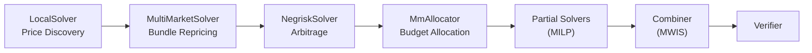

# Matching Engine

Sybil's matching engine finds the **optimal** set of trades — maximizing total welfare across all participants.

## Philosophy

Traditional exchanges use simple rules:
- **First-come-first-served (FCFS)**: Fastest wins
- **Pro-rata**: Split proportionally
- **Tip-based**: Highest payer wins

Sybil uses **welfare maximization**: Find the combination of fills that creates the most total value.

## What Is Welfare?

Welfare measures the surplus created by trades:

```
Trade Welfare = (Limit Price - Clearing Price) x Quantity
```

| Trader | Role | Limit | Clearing | Qty | Welfare |
|--------|------|-------|----------|-----|---------|
| Alice | Buyer | \$0.70 | \$0.55 | 100 | +\$15 |
| Bob | Buyer | \$0.60 | \$0.55 | 100 | +\$5 |
| Carol | Seller | \$0.45 | \$0.55 | 100 | +\$10 |
| Dave | Seller | \$0.50 | \$0.55 | 100 | +\$5 |
| **Total** | | | | | **\$35** |

The matching engine maximizes this total.

## Pipeline Architecture

The engine runs a multi-phase pipeline. The core components can be combined in different configurations depending on the problem:



Three solving modes are available:

| Mode | When | How |
|------|------|-----|
| **Single-pass** | Simple problems | Run each phase once sequentially |
| **Sequential (fixed-point)** | Cross-market pricing matters | Iterate phases until welfare converges |
| **Dual decomposition** | Price consistency + MM budgets | Lagrangian relaxation with subgradient updates |

### Phase 1: LocalSolver (Price Discovery)

Finds clearing prices for each market independently.

For each market:
1. Collect all bids and asks
2. Build supply/demand curves
3. Find intersection (clearing price)
4. Determine fills at clearing price

Single-market orders (~80% of volume) are fully handled here. Runs in O(n log n) per market.

**Output**: Clearing prices per market + fills for regular orders.

### Phase 2: MultiMarketSolver (Bundle Matching)

Handles multi-market orders (bundles, spreads, conditionals) via two strategies:

1. **Complement matching**: Orders with identical markets and negated payoffs cancel directly (e.g., a bundle buy and bundle sell). Standard bid >= ask matching.
2. **Repricing**: Injects bundle leg demand into per-market supply/demand curves and re-clears affected markets. Uses precomputed market curves for fast trial crossings — only commits to a full re-solve when the trial shows positive net welfare.

This allows bundle orders to influence per-market clearing prices, creating fills that wouldn't be possible by treating markets independently.

**Output**: Bundle fills + adjusted clearing prices for affected markets.

### Historical Phase 3: NegriskSolver (Arbitrage)

<Info>
Current canonical blocks do not contain synthetic orders or synthetic fills.
Minting/burning is represented by the protocol MINT account during settlement.
The NegriskSolver description below documents an older solver experiment where
synthetic orders were used only as internal price pressure.
</Info>

When prices for mutually exclusive outcomes don't sum to exactly \$1, there's an arbitrage opportunity. The historical NegriskSolver explored internal feedback orders that influence prices through market forces instead of directly rewriting prices.

| Case | Condition | Action |
|------|-----------|--------|
| **Negrisk** | Prices sum < \$1 | Buy all outcomes — guaranteed \$1 payout |
| **Posrisk** | Prices sum > \$1 | Sell all outcomes — only pay \$1 to winner |

In the sequential pipeline, feedback orders participated in the next iteration's LocalSolver clearing to push prices toward sum = \$1. Their fills were filtered out of the final result — they served as price pressure, not as output.

<Info>
Naively adjusting prices to force consistency can invalidate orders and **destroy welfare**. The NegriskSolver instead creates real market forces that **add welfare** — modeling what an arbitrageur would do, but keeping the surplus for users.
</Info>

**Output**: Internal price-pressure orders in the historical pipeline. They are
not canonical fills and must not enter block witnesses.

### Phase 4: MmAllocator (Budget Allocation)

Handles Flash Quote market makers with [solver-enforced balance constraints](/trading/flash-quoting).

For each MM:
1. Compute welfare for each potential fill
2. Compute capital cost for each fill
3. Rank by welfare/capital ratio
4. Activate orders greedily until balance constraint is hit

For interacting MMs (overlapping markets), uses fixed-point iteration to converge.

**Output**: Which MM orders to activate.

### Partial Solvers & Combination

Additional solvers can run in parallel on unfilled orders:

- **MilpSolver** (optional, feature-gated): Full integer linear program formulation. Provably optimal given a time budget. Uses HiGHS via `good_lp`.

When multiple solvers produce partial solutions, they may conflict. The **MWIS combiner** (Maximum Weight Independent Set) selects the best non-conflicting subset by building a conflict graph and solving for maximum welfare.

## Dual Decomposition

The dual decomposition solver (`Pipeline::with_dual_decomposition()`) handles two coupling constraints in a principled way using Lagrangian relaxation:

- **Price consistency**: YES prices across a MarketGroup must sum to \$1
- **MM budgets**: Capital usage must not exceed per-MM budget

### Algorithm

1. Initialize dual variables (lambda) to zero for each MarketGroup
2. For each iteration:
   - **Shade orders** using lambda — adjust limit prices to reflect price consistency pressure
   - **Solve per-market subproblems** with shaded orders via LocalSolver
   - **Validate candidate fills** against original (unshaded) limit prices
   - **Greedy MM knapsack**: Sort MM candidates by welfare/capital ratio, activate within remaining budget
   - **Accumulate fills** (permanent once accepted)
   - **Update lambda** via subgradient step: `lambda += step_size * residual`
   - **Check convergence**: price residuals < 2%, dual stability, welfare improvement < 1%

Step size decays as `alpha_0 / sqrt(t)` to ensure convergence.

After the dual solver converges, the pipeline runs MultiMarketSolver repricing for bundle orders and any partial solvers for remaining unfilled orders.

<Info>
The dual solver replaces the NegriskSolver's role — instead of creating internal feedback orders, it uses bid shading (adjusting limit prices via lambda) to drive prices toward consistency. Both approaches aim at the same price-consistency problem; dual decomposition is more principled while the sequential pipeline was an experiment.
</Info>

## Iteration & Convergence

The sequential pipeline iterates until convergence:

```
for iter in 0..max_iterations:
    LocalSolver -> MultiMarketSolver -> NegriskSolver -> MmAllocator
    if welfare_delta < threshold: break
```

Each phase depends on the previous: MultiMarketSolver needs per-market prices, NegriskSolver needs cross-market prices, MmAllocator needs stable prices. Typically converges in 2-5 iterations.

## Optimization Goals

<CardGroup cols={2}>
  <Card title="Primary: Welfare" icon="trophy">
    Maximize total surplus created
  </Card>
  <Card title="Secondary: Volume" icon="chart-bar">
    Among equal-welfare solutions, prefer higher volume
  </Card>
  <Card title="Constraint: Feasibility" icon="check">
    All fills must satisfy limit prices and balance constraints
  </Card>
  <Card title="Constraint: Atomicity" icon="atom">
    Multi-market payoff vectors are all-or-nothing
  </Card>
</CardGroup>

## Complexity

| Solver | Objective | Complexity | Guarantee |
|--------|-----------|------------|-----------|
| LocalSolver | Max welfare | O(n log n) | Optimal per-market |
| MultiMarketSolver | Max bundle welfare | O(n log n) per affected market | Heuristic (repricing) |
| NegriskSolver | Max arb welfare | O(groups x markets) | All exploitable arb |
| MmAllocator | Max welfare/budget | O(n log n) | Greedy approx |
| DualMaster | Max welfare (joint) | O(iterations x n log n) | Convergent |
| MilpSolver | Max welfare (exact) | Exponential | Optimal (with timeout) |

The engine is designed for **real-time** operation:
- Target: < 1 second for 10,000 orders
- Timeout: Batch interval minus proof time

## Correctness Guarantees

<Check>**No trade at worse price**: Fills never exceed limit prices</Check>
<Check>**Conservation**: Total bought = total sold per market</Check>
<Check>**Atomicity**: Multi-market payoff vectors execute together or not at all</Check>
<Check>**Consistency**: Prices don't allow risk-free arbitrage (resolved by NegriskSolver or dual decomposition)</Check>

These are verified by the [ZK proof](/technical/zk-proofs) — you don't have to trust the implementation.

## Comparison

| Engine Type | Optimizes For | Complexity | Fairness |
|-------------|---------------|------------|----------|
| FCFS | Speed | O(1) per order | Low (bots win) |
| Pro-rata | Equality | O(n) | Medium |
| Price-time | Price then speed | O(n log n) | Medium |
| **Welfare-max** | Total surplus | Higher | **High** |
