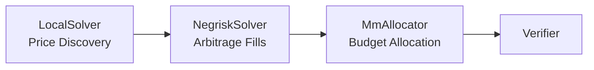

# Matching Engine

Sybil's matching engine finds the **optimal** set of trades — maximizing total welfare across all participants.

## Philosophy

Traditional exchanges use simple rules:
- **First-come-first-served (FCFS)**: Fastest wins
- **Pro-rata**: Split proportionally
- **Tip-based**: Highest payer wins

Sybil uses **welfare maximization**: Find the combination of fills that creates the most total value.

## What Is Welfare?

Welfare measures the surplus created by trades:

```
Trade Welfare = (Limit Price - Clearing Price) × Quantity
```

| Trader | Role | Limit | Clearing | Qty | Welfare |
|--------|------|-------|----------|-----|---------|
| Alice | Buyer | \$0.70 | \$0.55 | 100 | +\$15 |
| Bob | Buyer | \$0.60 | \$0.55 | 100 | +\$5 |
| Carol | Seller | \$0.45 | \$0.55 | 100 | +\$10 |
| Dave | Seller | \$0.50 | \$0.55 | 100 | +\$5 |
| **Total** | | | | | **\$35** |

The matching engine maximizes this total.

## Pipeline Architecture

The engine runs a multi-phase pipeline where each solver handles specific constraints and passes results downstream:



### Phase 1: LocalSolver (Price Discovery)

Finds clearing prices for each market independently.

For each market:
1. Collect all bids and asks
2. Build supply/demand curves
3. Find intersection (clearing price)
4. Determine fills at clearing price

Single-market orders (~80% of volume) are fully handled here. Runs in O(n log n) per market.

**Output**: Clearing prices per market + fills for regular orders.

### Phase 2: NegriskSolver (Arbitrage)

When prices for mutually exclusive outcomes don't sum to exactly \$1, there's an arbitrage opportunity. Instead of artificially adjusting prices (which destroys welfare), the NegriskSolver creates **real arbitrage fills**.

| Case | Condition | Action |
|------|-----------|--------|
| **Negrisk** | Prices sum < \$1 | Buy all outcomes — guaranteed \$1 payout |
| **Posrisk** | Prices sum > \$1 | Sell all outcomes — only pay \$1 to winner |

<Info>
Naively adjusting prices to force consistency can invalidate orders and **destroy welfare**. NegriskSolver instead creates real fills that **add welfare** — modeling what an arbitrageur would do, but keeping the surplus for users.
</Info>

**Output**: Arbitrage orders and fills with positive welfare contribution.

### Phase 3: MmAllocator (Budget Allocation)

Handles Flash Quote market makers with [solver-enforced balance constraints](/trading/flash-quoting).

For each MM:
1. Compute welfare for each potential fill
2. Compute capital cost for each fill
3. Rank by welfare/capital ratio
4. Activate orders greedily until balance constraint is hit

For interacting MMs (overlapping markets), uses fixed-point iteration to converge.

**Output**: Which MM orders to activate.

## Iteration & Convergence

The pipeline iterates until convergence:

```
for iter in 0..max_iterations:
    LocalSolver → NegriskSolver → MmAllocator
    if welfare_delta < threshold: break
```

Each phase depends on the previous: NegriskSolver needs raw prices, MmAllocator needs stable prices.

Typically converges in 2-5 iterations.

## Optimization Goals

<CardGroup cols={2}>
  <Card title="Primary: Welfare" icon="trophy">
    Maximize total surplus created
  </Card>
  <Card title="Secondary: Volume" icon="chart-bar">
    Among equal-welfare solutions, prefer higher volume
  </Card>
  <Card title="Constraint: Feasibility" icon="check">
    All fills must satisfy limit prices and balance constraints
  </Card>
  <Card title="Constraint: Atomicity" icon="atom">
    Multi-market payoff vectors are all-or-nothing
  </Card>
</CardGroup>

## Complexity

| Solver | Objective | Complexity | Guarantee |
|--------|-----------|------------|-----------|
| LocalSolver | Max welfare | O(n log n) | Optimal per-market |
| NegriskSolver | Max arb welfare | O(groups × markets) | All exploitable arb |
| MmAllocator | Max welfare/budget | O(n log n) | Greedy approx |

The engine is designed for **real-time** operation:
- Target: < 1 second for 10,000 orders
- Timeout: Batch interval minus proof time

## Correctness Guarantees

<Check>**No trade at worse price**: Fills never exceed limit prices</Check>
<Check>**Conservation**: Total bought = total sold per market</Check>
<Check>**Atomicity**: Multi-market payoff vectors execute together or not at all</Check>
<Check>**Consistency**: Prices don't allow risk-free arbitrage (NegriskSolver resolves these)</Check>

These are verified by the [ZK proof](/technical/zk-proofs) — you don't have to trust the implementation.

## Comparison

| Engine Type | Optimizes For | Complexity | Fairness |
|-------------|---------------|------------|----------|
| FCFS | Speed | O(1) per order | Low (bots win) |
| Pro-rata | Equality | O(n) | Medium |
| Price-time | Price then speed | O(n log n) | Medium |
| **Welfare-max** | Total surplus | Higher | **High** |
