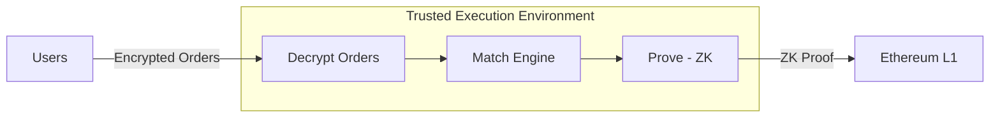

# Privacy Architecture

Sybil provides **real privacy** — not "trust us" privacy. Your orders are protected cryptographically, and execution is verified mathematically.

## Why Privacy Matters

In prediction markets, information is money. If others can see your trades:

<CardGroup cols={2}>
  <Card title="Front-running" icon="person-running">
    Bots detect your order and trade ahead of you, moving the price against you.
  </Card>
  <Card title="Copy-trading" icon="copy">
    Others copy your positions, eroding your edge. Your alpha becomes everyone's alpha.
  </Card>
  <Card title="Information leakage" icon="eye">
    Your positions reveal your views. Counterparties can use this against you.
  </Card>
  <Card title="Reputation risk" icon="user-secret">
    Public track records attract copiers. The best traders must hide.
  </Card>
</CardGroup>

## The 3EV Framework

From MEV research, we use the **3EV framework** to analyze value extraction:

| Type | Description | Sybil's Solution |
|------|-------------|------------------|
| **MafiaEV** | Extraction via information asymmetry (front-running, copy-trading) | **Private orders eliminate this** |
| **MolochEV** | Value lost to uncoordination (defensive spreads, latency races) | **Batch auctions coordinate** |
| **MonarchEV** | Extraction by whoever controls execution | **ZK proofs constrain the monarch** |

### MafiaEV → Zero

Orders are encrypted and processed inside a TEE. Nobody sees your position until after the batch settles. No front-running. No copy-trading.

### MolochEV → Minimized

Batch auctions are coordinated clearing. Market makers don't need to widen spreads defensively because there's no speed disadvantage.

### MonarchEV → Constrained

The TEE (the "monarch") can see orders but cannot cheat on execution — that's ZK-proven. The only possible misbehavior is censorship, which is detectable.

## Architecture

## Trusted Execution Environment (TEE)

The TEE is a secure enclave that:

<Check>Processes orders in isolation from the host system</Check>
<Check>Encrypts all data at rest and in transit</Check>
<Check>Provides remote attestation (prove what code is running)</Check>
<Check>Cannot leak data even to the operator</Check>

### What the TEE Can Do

| Capability | Status |
|------------|--------|
| See decrypted orders | Yes (necessary for matching) |
| Compute matches | Yes |
| Generate ZK proofs | Yes |

### What the TEE Cannot Do

| Attack | Prevention |
|--------|------------|
| Leak orders externally | TEE isolation |
| Manipulate matches | ZK proof verification |
| Steal funds | ZK-proven state transitions |
| Front-run users | No external communication during matching |

### Possible Misbehavior: Censorship

The TEE could theoretically **not include** your order. This is:

- **Detectable**: You submitted an order, it didn't appear
- **Attributable**: The TEE operator is responsible
- **Costly**: Reputation damage, users leave

<Note>
Censorship is the only attack vector. And it's detectable. This is a much narrower trust assumption than "trust us completely."
</Note>

## Zero-Knowledge Proofs

Every batch generates a [ZK proof](/technical/zk-proofs) that verifies matching correctness, price constraints, balance conservation, and state validity — without revealing any private data (orders, balances, positions, trading patterns).

## Privacy Model

| Data | Who Can See | Notes |
|------|-------------|-------|
| Individual orders | **Nobody** (encrypted in TEE) | Private by default |
| Your balances | **Only you** | Query via signed request |
| Your positions | **Only you** | Query via signed request |
| Clearing prices | **Public** | Fair price for all |
| Total volume | **Public** | Market transparency |
| Deposit amounts | **Public** | L1 transaction visible |
| Withdraw amounts | **Public** | L1 transaction visible |

### Deposit Privacy (Future)

Currently, deposits link your L1 address to Sybil. Future improvements:

- **Commitment schemes**: Deposit to a commitment, claim with ZK proof
- **Mixer integration**: Deposit via Tornado-style mixer
- **Cross-chain deposits**: Deposit from different chain, breaks link

## Selective Disclosure

Privacy is the default. But you can **choose** to reveal information via ZK proofs.

### Provable Claims

| Claim | What You Prove | What You Don't Reveal |
|-------|----------------|----------------------|
| "I'm profitable" | PnL ≥ X | Which trades, which markets |
| "I'm top 10" | Rank in top 10 | Exact rank, positions |
| "High Sharpe" | Risk-adjusted return | Individual trades |
| "100+ trades" | Trade count ≥ 100 | Which markets, sizes |

### Use Cases

- **Reputation building**: Prove track record to attract capital
- **Fund raising**: Show returns without revealing strategy
- **Credentialing**: Use trading skill as a verifiable credential

## Comparison to Competitors

| Feature | Competitor A | Competitor B | Sybil |
|---------|--------------|--------------|-------|
| Order privacy | None (public) | "Trust us" | **TEE-enforced** |
| Execution verification | None | None | **ZK-proven** |
| Selective disclosure | None | None | **ZK proofs** |
| Deposit privacy | None | None | Roadmap |

## Security Considerations

### TEE Vulnerabilities

TEEs (like Intel SGX) have had vulnerabilities. Sybil mitigates:

- **Defense in depth**: ZK proofs verify execution even if TEE compromised
- **Limited data exposure**: TEE only sees current batch orders
- **Regular updates**: Apply security patches promptly
- **Multiple TEE support**: Future support for different TEE vendors

### ZK Soundness

ZK proofs are cryptographically sound:

- Based on well-studied assumptions (Halo2 SNARKs, no trusted setup)
- Publicly verifiable
- Bug bounty program for vulnerabilities

### Operational Security

- **Key management**: Multi-sig for critical operations
- **Monitoring**: Anomaly detection for unusual patterns
- **Incident response**: Published procedures for security events
