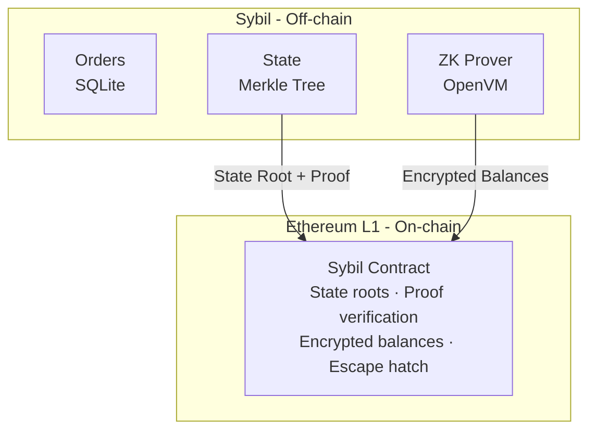

# Validium Architecture

Sybil is a **validium** — a Layer 2 that keeps data off-chain while posting validity proofs on-chain.

## Why Validium?

### The Data Availability Tradeoff

| Architecture | Data | Proofs | Cost | Privacy | Security |
|--------------|------|--------|------|---------|----------|
| L1 | On-chain | N/A | $$$$ | None | Maximum |
| Rollup | On-chain | On-chain | $$$ | Low | High |
| **Validium** | Off-chain | On-chain | $ | **High** | High* |

*With proper escape hatch design

### Cost Analysis

Posting 10,000 orders to Ethereum:
- **Calldata**: ~500 bytes per order × 10,000 = 5 MB
- **Cost**: ~\$5,000+ at typical gas prices

Posting a ZK proof for 10,000 orders:
- **Proof size**: < 1 KB (constant)
- **Cost**: ~\$50

**100x cost reduction** by moving data off-chain.

### Privacy Benefit

On-chain data is public forever. Even encrypted data may be decrypted as cryptography advances.

Off-chain data:
- Lives only in the TEE
- Never touches a public blockchain
- Can be deleted after settlement

## Architecture



## State Management

### Merkle Tree

All user state (balances, positions) is stored in a Merkle tree off-chain. Only the root is posted on-chain.

### Encrypted Balances On-Chain

After each batch, the TEE posts **encrypted account state** for every changed account:

```solidity
event AccountUpdate(uint256 indexed accountId, bytes encryptedState);
// encryptedState = Enc(balance + positions ≥ $100, user_p256_pubkey)
```

Each account state is encrypted with the user's P256 public key. Only the user can decrypt it. This serves as the data availability layer — your state is always recoverable from L1 events.

Positions below \$100 are excluded to bound gas costs and prevent spam.

### Batch Processing

Each batch follows this order:

1. **Process deposits & withdrawals** — update balances first
2. **Run matching engine** — sees updated balances, orders that exceed balance don't fill
3. **Generate SNARK proof** — proves the entire batch is valid
4. **Post to L1** — state root, batch proof, encrypted balance updates

```rust
pub struct BatchProof {
    pub old_root: [u8; 32],
    pub new_root: [u8; 32],
    pub batch_id: u64,
    pub proof: Vec<u8>,  // SNARK proof
}
```

## L1 Contract

```solidity
contract Sybil {
    bytes32 public stateRoot;
    uint64 public batchId;
    mapping(uint256 => bool) public escaped; // prevent double-withdrawal

    function postBatch(
        bytes32 newRoot,
        uint64 newBatchId,
        bytes calldata proof
    ) external onlySequencer {
        require(verifyProof(stateRoot, newRoot, proof), "Invalid proof");
        stateRoot = newRoot;
        batchId = newBatchId;
        // Encrypted balance updates emitted as events
    }

    function deposit(uint256 amount) external {
        sUSDS.transferFrom(msg.sender, address(this), amount);
        emit Deposit(msg.sender, amount);
    }

    function escapeHatch(
        uint256 accountId,
        uint256 balance,
        bytes calldata zkProof
    ) external {
        require(!escaped[accountId], "Already escaped");
        require(verifyEscapeProof(accountId, balance, zkProof), "Invalid proof");
        escaped[accountId] = true;
        sUSDS.transfer(msg.sender, balance);
    }
}
```

## Escape Hatch

If the sequencer goes offline, users can withdraw using only **their private key** and **on-chain data**:

<Steps>
  <Step title="Read Encrypted Balance">
    Scan L1 events for the latest `BalanceUpdate` for your account. This is on Ethereum — always available.
  </Step>
  <Step title="Decrypt Locally">
    Decrypt your balance with your P256 private key. Only you can do this.
  </Step>
  <Step title="Generate ZK Proof">
    Generate a ZK proof: "I know the P256 private key for this account, and the decryption of the on-chain ciphertext yields balance X."
  </Step>
  <Step title="Submit & Withdraw">
    Submit the proof to the L1 contract. Funds released immediately. No challenge period.
  </Step>
</Steps>

<Info>
**No off-chain data needed.** Unlike most validiums that require a Data Availability Committee (DAC) or external DA layer, Sybil stores encrypted balances directly on L1 as events. You only need your private key and an Ethereum node.
</Info>

### Positions

Positions (shares in markets) can also be escaped — as **L1 conditional tokens**:

```solidity
function escapePosition(
    uint256 accountId, uint256 marketId,
    bool isYes, uint256 amount, bytes calldata zkProof
) external {
    require(verifyPositionProof(accountId, marketId, isYes, amount, zkProof));
    conditionalToken.mint(msg.sender, marketId, isYes, amount);
}
```

Once you have YES/NO tokens on L1, standard operations apply — no sequencer needed:

| Action | How | Sequencer Needed |
|--------|-----|-----------------|
| **Merge** | Burn N YES + N NO → get N sUSDS | No |
| **Resolve** | Oracle posts outcome → winning tokens = \$1 | No |
| **Trade** | YES/NO are ERC-20s — Uniswap, OTC, etc. | No |

<Note>
Only positions ≥ \$100 are included in the encrypted on-chain state. Smaller positions are off-chain only — the gas cost of protecting them exceeds their value.
</Note>

### Priority Queue

If the sequencer is slow but still online, users can force inclusion via a priority queue on L1:

```solidity
struct PriorityRequest {
    address user;
    bytes calldata;
    uint256 requestTime;
}
```

The sequencer must process priority queue requests or be considered offline.

### Liveness Guarantee

| Scenario | User Action |
|----------|-------------|
| Sequencer online | Normal withdrawal (instant) |
| Sequencer slow | Priority request (forces inclusion) |
| Sequencer offline | Escape hatch (decrypt + ZK proof → instant withdrawal) |

Users can always exit, even if Sybil stops operating.

## Data Availability

Unlike traditional validiums that rely on a DAC or external DA layer:

| Approach | Trust Assumption | Privacy |
|----------|-----------------|---------|
| DAC | 1-of-N committee members honest | **Broken** — DAC sees plaintext |
| Celestia/EigenDA | DA layer available | Encrypted diffs preserve privacy |
| **Sybil (L1 events)** | Ethereum available | **Encrypted** — only you can read |

Sybil posts encrypted balance updates as L1 events. Your data availability is Ethereum itself — no additional trust assumptions beyond "Ethereum works."

## Collateral

Sybil uses sUSDS as collateral — your capital earns yield while you trade.

### Yield Handling

sUSDS accrues yield via exchange rate changes:
- Day 1: 1 sUSDS = \$1.00
- Day 365: 1 sUSDS = \$1.04 (4% APY)

No rebasing — balances stay constant, value grows.

## Security Model

### Trust Assumptions

| Component | Trust Level | Mitigation |
|-----------|-------------|------------|
| Sequencer liveness | Needed for UX | Escape hatch |
| Sequencer honesty | Not needed | ZK proofs |
| Data availability | **Ethereum L1** | Encrypted balances on-chain |
| L1 security | Ethereum assumptions | Inherits Ethereum security |

### Attack Vectors

| Attack | Feasible? | Defense |
|--------|-----------|---------|
| Steal funds | No | ZK proofs verify all transitions |
| Fake trades | No | ZK proofs verify matching |
| Censor users | Detectable | Priority queue, escape hatch |
| Front-run | No | TEE isolation |
| Deny withdrawal | Temporary only | Escape hatch (ZK proof, no timeout) |

## Comparison to Alternatives

| Feature | Rollup | Plasma | Validium + DAC | Sybil |
|---------|--------|--------|----------------|-------|
| Data on-chain | Yes | No | No | **Encrypted balances** |
| Validity proofs | Yes | No (fraud proofs) | Yes | Yes |
| Exit time | Instant | 7+ days | Instant | **Instant** |
| Privacy | Low | Medium | Low (DAC sees data) | **High** |
| DA trust | Ethereum | Operator | Committee | **Ethereum** |
| Cost | Medium | Low | Low | **Low** |
