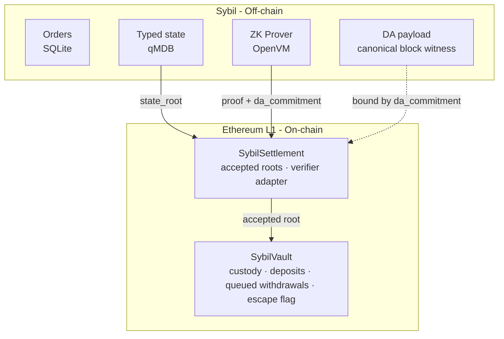

# Validium Architecture

Sybil is a **validium** — a Layer 2 that keeps block data off-chain while
posting validity proofs on-chain.

<Info>
**How to read this page.** Sections describing what runs today are written in
the present tense and point to the normative specs in `docs/architecture/`.
Sections describing mechanisms that are **designed but not yet implemented** are
marked with a **Status** callout and link to the owning design doc and Linear
ticket. Do not assume a mechanism exists unless it is stated as shipped.
</Info>

## Why Validium?

### The Data Availability Tradeoff

| Architecture | Data | Proofs | Cost | Privacy | Security |
|--------------|------|--------|------|---------|----------|
| L1 | On-chain | N/A | $$$$ | None | Maximum |
| Rollup | On-chain | On-chain | $$$ | Low | High |
| **Validium** | Off-chain | On-chain | $ | **High** | High* |

*Security depends on data availability and exit design. See
[Data Availability](#data-availability) and
[Emergency Exit](#emergency-exit) below for the current, honest status.

### Cost Analysis

Posting 10,000 orders to Ethereum:
- **Calldata**: ~500 bytes per order × 10,000 = 5 MB
- **Cost**: ~\$5,000+ at typical gas prices

Posting a ZK proof for 10,000 orders:
- **Proof size**: < 1 KB (constant)
- **Cost**: ~\$50

**100x cost reduction** by moving data off-chain.

### Privacy Benefit

On-chain data is public forever. Off-chain data need never touch a public
blockchain. Sybil keeps the block payload off-chain and posts only a validity
proof plus a `daCommitment` that binds the off-chain payload. What the payload
contains, and how it is protected, is covered under
[Data Availability](#data-availability).

## Architecture



The on-chain surface is two contracts, `SybilSettlement` and `SybilVault`, not
a single monolith. `SybilSettlement` is the root of trust for accepted state
roots; `SybilVault` is the only contract that holds collateral. The normative
description lives in the architecture note *L1 Settlement and Vault*
(`docs/architecture/L1 Settlement and Vault.md`).

## State Management

### Typed State Tree

All exchange state — accounts, balances, positions, reservations, resting
orders, markets, groups, and pending withdrawals — lives in an off-chain
authenticated key/value store (commonware ordered-current qMDB, SHA-256). Only
the `state_root` over the typed leaves is posted on-chain. The byte-level
commitment contract is normative in *State Root Schema*
(`docs/architecture/State Root Schema.md`).

### Data Availability commitment

Instead of posting per-account data on-chain, each accepted root carries a
single `daCommitment` — a BLAKE3 envelope that binds the off-chain block
payload (its `witness_root`, `payload_root`, payload length, and
provider-reference hash) into the same OpenVM public input the proof verifies.
The OpenVM guest recomputes the commitment from the private witness and rejects
any public input that does not match; `SybilSettlement` stores the proven value
in `RootRecord.daCommitment`. The contract does **not** attempt to judge whether
the referenced data is actually available — that is an availability question,
not a state-transition-correctness question.

**Since block witness v3, one DA payload is a complete state snapshot** — the
canonical witness carries the full pre/post account sections, the full state
sidecars (markets, groups, resting orders, reservations), and the deposit
frontier. Reconstructing state at a root therefore needs exactly one payload
whose `daCommitment` matches an accepted on-chain root — no per-account events,
no replay chain, no periodic-snapshot schedule.

The full definition (commitment preimage, payload contents, provider-reference
model, retention) is normative in *Data Availability*
(`docs/architecture/Data Availability.md`).

<Note>
**Today the DA payload is plaintext and operator-hosted.** The current
file-backed / API-served payload is deliberately scaffolding for the
proof pipeline — it proves the commitment plumbing works without deciding that
plaintext witness publication is the production privacy model. The encryption
and emergency-disclosure design (below) is what makes this private.
</Note>

### Batch Processing

Each batch follows this order:

1. **Process deposits & withdrawals** — update balances first.
2. **Run matching engine** — sees updated balances; orders that exceed balance
   don't fill.
3. **Generate SNARK proof** — proves the entire batch is valid (order validity,
   settlement arithmetic, state-root update, qMDB path checks, deposit
   consumption, withdrawal-leaf creation).
4. **Post to L1** — accepted root record: `state_root`, `daCommitment`,
   deposit-log checkpoint, and the OpenVM proof.

The proven public inputs are, in essence:

```solidity
struct StateTransitionPublicInputs {
    uint64 previousHeight;
    uint64 newHeight;
    bytes32 previousStateRoot;
    bytes32 newStateRoot;
    bytes32 blockHash;
    bytes32 eventsRoot;
    bytes32 witnessRoot;
    bytes32 daCommitment;
    bytes32 depositRoot;
    uint64 depositCount;
}
```

## L1 Contracts

`SybilSettlement` owns proof acceptance and the accepted-root chain.
`SybilVault` owns custody and money movement. Withdrawals are **claims against
committed withdrawal leaves**, queued and delayed — not instant transfers of a
raw account balance. The exact ABI, root record, verifier-adapter boundary, and
governance roles are normative in *L1 Settlement and Vault*
(`docs/architecture/L1 Settlement and Vault.md`).

### Deposits

Deposits are asynchronous: the user calls `deposit(amount, sybilAccountKey)`,
the vault appends a deposit leaf to an incremental Merkle tree, and the
sequencer credits the Sybil account in a later block. The state-transition proof
verifies credited deposits against the L1 deposit-log root, so an off-chain
block cannot credit unbacked deposits.

### Normal withdrawals (queued + delayed)

Normal withdrawals are sequencer-cooperative and **not instant**:

1. User requests a withdrawal through the Sybil API; the sequencer debits the
   account and a typed `withdrawal/{withdrawal_id}` leaf appears in the state
   root.
2. User submits a ZK withdrawal proof to `SybilVault.requestWithdrawal`.
3. The vault records the nullifier and **queues** the withdrawal.
4. After `withdrawalDelay` (a governance-set safety window, ~24h — SYB-97),
   anyone can finalize and transfer funds to the recipient.

The delay is an operational safety window (time for a guardian to pause on a
misconfiguration), not a fraud-proof window — the proofs are validity proofs.

## Emergency Exit

If accepted roots stop arriving, users must be able to recover. The exit story
has a shipped part and a designed-but-unshipped part; the distinction matters.

### Escape mode (shipped): a timeout-gated flag

`SybilVault` tracks liveness and lets **anyone** flip an escape flag once roots
go stale:

```text
block.timestamp > livenessReference + escapeTimeout   →   activateEscapeMode()
```

`livenessReference` is the latest root's `verifiedAt` (or the vault deployment
time before the first root, so pre-genesis deposits are not trapped). Calling
`activateEscapeMode()` sets `escapeModeActive = true` and emits
`EscapeModeActivated`. This is a **timeout-gated flag** — there is no instant,
no-timeout escape.

<Warning>
**Status: the on-chain cash escape-claim is NOT implemented (SYB-32 / SYB-80,
tracked as H14).** Activating escape mode today only sets the flag; there is no
`escapeClaim` / `escapeWithdraw` entrypoint. The vault **fails closed**:
`requestWithdrawal` rejects any `claimKind != CLAIM_KIND_NORMAL`
(`UnsupportedClaimKind`), and the old `CLAIM_KIND_ESCAPE` constant that
advertised the absent mechanism has been removed. `claimKind` stays bound into
the withdrawal public-input hash so a future escape entrypoint can be added
without changing the proof shape of normal withdrawals.
</Warning>

### Escape claim (future design): conservative cash exit

<Info>
**Status: future design, not implemented.** Specified in
`design/escape-claim-guest.md` (SYB-32) and
`design/escape-hatch-reconstruction.md` (SYB-80); both are **DRAFT — for
ratification**. It requires a *distinct* ZK guest program with its own public
input shape and app commitment, plus a `claimKind`-dispatched vault entrypoint.
</Info>

When implemented, an escape claim is intended to be a proof-backed **cash-only**
withdrawal from the latest accepted root:

1. The user obtains that root and the state data — from a DA payload (the
   common case) or from a small self-held custody snapshot of their own leaf
   proofs.
2. A ZK proof binds the user's registered account key, proves `acct/{id}` and
   `acct_resv/{id}` membership against the root, and computes conservative
   withdrawable cash:

```text
withdrawable_cash = max(0, balance - open_cash_reservations)
```

3. The vault accepts at most one escape claim per account per root
   (`escape_nullifier`), gated on `escapeModeActive`.

<Note>
**Positions are not force-settled on L1.** An earlier design that minted
YES/NO positions and unresolved market claims as on-chain conditional tokens via
an `escapePosition` entrypoint has been **abandoned**: unwinding prediction-market
positions on L1 would move resolution and settlement logic into the vault, which
is the wrong boundary for a validium. Positions, resting orders, and claims on
future resolutions are recovered by **operator replacement**, not by an
individual on-chain force-exit. The escape claim is deliberately cash-only.
</Note>

### Prerequisite: an account-key commitment in state

<Info>
**Status: future design, not implemented (SYB-225, DRAFT).** A trustless escape
claim needs the account leaf to commit to the account's signing-key set so the
guest can bind an account to a signer. Today `acct/` leaves carry no key
commitment (the key registry is unproven sequencer state). Adding a
`keys_digest` to account leaves is a consensus change (witness v3 → v4, guest
repin) specified in `design/account-keys-digest.md` and batched with SYB-224.
</Info>

### Full recovery: DA-backed operator replacement

The primary full-recovery path is **operator replacement**: reconstruct the
complete typed state from one DA payload, verify it against the accepted
`state_root`, and continue the exchange with a replacement operator. This
recovers everything (balances, positions, resting orders, markets, pending
withdrawals), not just cash.

<Info>
**Status: design landed, importer in progress (SYB-116, DRAFT).** The
reconstruction *mechanics* are specified in
`design/escape-hatch-reconstruction.md` (SYB-80); *who runs them, when, and
under what disclosure model* in `docs/architecture/Operator Replacement.md`
(SYB-116). The doc distinguishes **R-A** (disaster recovery by the same
operator — buildable now) from **R-B** (trustless replacement by a different
party — gated on an L1 appointment mechanism that does not yet exist). The
genesis-from-witness importer is the remaining implementation increment.
</Info>

### Liveness, honestly

| Scenario | User path | Status |
|----------|-----------|--------|
| Sequencer online | Normal withdrawal → queued, finalizes after `withdrawalDelay` | **Shipped** |
| Roots stale past `escapeTimeout` | Anyone calls `activateEscapeMode()` (sets flag) | **Shipped** |
| Escape mode active, cash exit | Proof-backed `escapeClaim` | **Not implemented** (SYB-32/80) |
| Operator gone, full state recovery | DA-backed operator replacement | **Design landed** (SYB-116), importer WIP |

There is no priority-queue / forced-inclusion entrypoint in the contracts; an
earlier design for one has been **abandoned**. Censorship resistance rests on
escape mode plus operator replacement, not a per-request L1 force-include queue.

## Data Availability

Sybil is a validium, so availability and validity are separate guarantees. The
proof says the new root follows from the private witness; `daCommitment` says
which off-chain payload the operator claims was made available. The contract
never judges availability.

| Approach | Trust assumption | Privacy |
|----------|------------------|---------|
| DAC | 1-of-N committee members honest | Broken — DAC sees plaintext |
| Celestia / EigenDA | External DA layer available | Depends on encryption |
| **Sybil (today)** | Operator hosts plaintext payload | **None yet — scaffolding** |
| **Sybil (planned)** | Encrypted payload + escrowed key | Private; disclose only on escape |

Today the payload is a plaintext canonical witness, served by the operator's
own API and (optionally) mirrored — acceptable on devnet with dev funds and no
user privacy to protect, and explicitly flagged as scaffolding in *Data
Availability*.

<Info>
**Status: future design, not implemented (SYB-120).** Before real users, the
payload is to be **encrypted** with a per-era content key; `daCommitment` keeps
binding the *plaintext* bytes so nothing about the proof or guest changes. The
recommended key custody is a **2-of-3 Shamir split** (operator + two independent
holders), with shares combinable **only when `escapeModeActive` is true on L1** —
the same publicly-checkable, timeout-gated condition described above. This gives
recovery if the operator is incapacitated without making state public in normal
operation. Rejected alternatives (MPC/threshold networks, TEE-held keys,
per-user encrypted leaves) are recorded in
`docs/architecture/Operator Replacement.md` §3. There is **no** per-account
encrypted-balance-on-L1 mechanism, planned or shipped.
</Info>

## Collateral

Sybil's on-chain accounting is in nanos. The initial production asset is a
single ERC20; the vault converts exactly with `NANOS_PER_TOKEN_UNIT = 1000`
(i.e. a 6-decimal, USDC-like token — see *L1 Settlement and Vault*).

{/* [VERIFY] The prose below describes sUSDS yield accrual. The deployed
SybilVault is a generic 6-decimal ERC20 vault (NANOS_PER_TOKEN_UNIT = 1000);
sUSDS (18 decimals, rebasing-by-exchange-rate) is not reflected in the contract.
Treat the yield story as a product aspiration, not a shipped mechanism, until
the collateral asset is confirmed. */}

<Note>
**Status: yield-bearing collateral is a product aspiration, not confirmed in
the deployed vault.** The intent is a yield-bearing asset (e.g. sUSDS) so
capital earns while it trades — value grows via exchange rate, no rebasing. The
current `SybilVault` is a plain 6-decimal ERC20 custody contract and does not
itself implement yield accrual.
</Note>

## Security Model

### Trust Assumptions

| Component | Trust level | Mitigation |
|-----------|-------------|------------|
| Sequencer liveness | Needed for UX | Escape mode (flag today; cash-claim planned) |
| Sequencer honesty | Not needed for state validity | ZK proofs |
| Data availability | Operator today; escrowed key planned | DA payload + planned encryption/disclosure (SYB-120) |
| L1 security | Ethereum assumptions | Inherits Ethereum security |

### Attack Vectors

| Attack | Feasible? | Defense |
|--------|-----------|---------|
| Steal funds | No | ZK proofs verify all transitions |
| Fake trades | No | ZK proofs verify matching |
| Censor users | Detectable | Escape mode; operator replacement |
| Withhold data | Possible today | Planned encrypted DA + escrow (SYB-120); operator replacement |
| Deny withdrawal | Bounded | Withdrawal queue + timeout-gated escape mode |

## Comparison to Alternatives

| Feature | Rollup | Plasma | Validium + DAC | Sybil |
|---------|--------|--------|----------------|-------|
| Data on-chain | Yes | No | No | No (off-chain payload, `daCommitment` bound) |
| Validity proofs | Yes | No (fraud proofs) | Yes | Yes |
| Exit time | Instant | 7+ days | Instant | Queued + delayed; timeout-gated escape flag |
| Privacy | Low | Medium | Low (DAC sees data) | Planned high (encrypted DA — SYB-120) |
| DA trust | Ethereum | Operator | Committee | Operator today → escrowed-key disclosure (planned) |
| Cost | Medium | Low | Low | **Low** |
