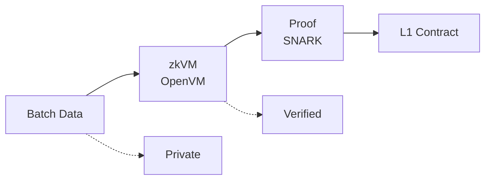
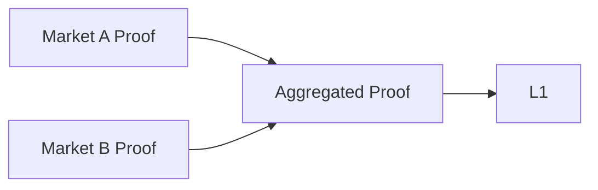
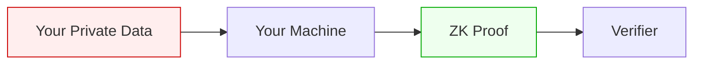

# ZK Proofs

Every Sybil batch generates a zero-knowledge proof that verifies correct execution without revealing private data.

## What We Prove

<CardGroup cols={2}>
  <Card title="Matching Correctness" icon="check">
    The fills computed are valid given the submitted orders
  </Card>
  <Card title="Price Constraints" icon="dollar-sign">
    All trades satisfy limit price constraints
  </Card>
  <Card title="Balance Conservation" icon="scale-balanced">
    No funds created or destroyed
  </Card>
  <Card title="State Validity" icon="database">
    New state root follows from old state + batch
  </Card>
</CardGroup>

## What We Don't Reveal

<CardGroup cols={2}>
  <Card title="Individual Orders" icon="eye-slash">
    Who ordered what at which price
  </Card>
  <Card title="User Balances" icon="eye-slash">
    How much each user holds
  </Card>
  <Card title="Positions" icon="eye-slash">
    Who has exposure to which markets
  </Card>
  <Card title="Trading Patterns" icon="eye-slash">
    Historical behavior
  </Card>
</CardGroup>

## Technology: SNARKs

Sybil uses **SNARKs** (Succinct Non-interactive Arguments of Knowledge) based on **Halo2** — no trusted setup required.

| Property | Value |
|----------|-------|
| Proof system | Halo2 (no trusted setup) |
| Proof size | < 1 KB |
| Verification cost | ~200k gas |
| Prover | OpenVM |
| Verification | On-chain (Ethereum L1) |

### Why SNARKs?

<Accordion title="Tiny proofs, cheap verification">
SNARK proofs are tiny (< 1 KB) and verify in ~200k gas on Ethereum. This makes on-chain verification practical and cheap — essential for a validium that posts proofs every batch.
</Accordion>

<Accordion title="Battle-tested on L2">
Every major L2 validium and rollup uses SNARKs for on-chain verification. The tooling, libraries, and security assumptions are well-understood and widely audited.
</Accordion>

<Accordion title="OpenVM integration">
OpenVM compiles Rust programs into SNARK-provable circuits. This means the matching engine code is the proof — no separate circuit implementation needed.
</Accordion>

## Proof Pipeline



### Step 1: Batch Compilation

The batch data is compiled into a witness:
- Old state (Merkle tree)
- Orders (encrypted, decrypted in TEE)
- Fills (computed by matching engine)
- New state (after applying fills)

### Step 2: zkVM Execution

The matching logic runs inside a zkVM (OpenVM):

```rust
fn prove_batch(input: BatchInput) -> BatchOutput {
    // Verify old state root
    assert!(verify_merkle_root(input.old_state));

    // Verify all fills satisfy constraints
    for fill in &input.fills {
        let order = input.orders.get(fill.order_id);
        assert!(fill.price <= order.limit_price);  // Price constraint
        assert!(fill.amount <= order.remaining);    // Amount constraint
    }

    // Verify balance conservation
    let total_bought: i64 = input.fills.iter()
        .filter(|f| f.side == Buy)
        .map(|f| f.amount as i64)
        .sum();
    let total_sold: i64 = input.fills.iter()
        .filter(|f| f.side == Sell)
        .map(|f| f.amount as i64)
        .sum();
    assert!(total_bought == total_sold);

    // Compute new state root
    let new_state = apply_fills(input.old_state, &input.fills);

    BatchOutput {
        old_root: input.old_state.root(),
        new_root: new_state.root(),
        clearing_prices: compute_prices(&input.fills),
        total_volume: compute_volume(&input.fills),
    }
}
```

### Step 3: Proof Generation

OpenVM generates a SNARK proof that the computation was correct.

The proof attests:
- The program ran correctly
- The inputs satisfy the constraints
- The outputs are correct

### Step 4: On-chain Verification

The proof can be verified on L1:

```solidity
function verifyBatch(
    bytes32 oldRoot,
    bytes32 newRoot,
    uint256[] clearingPrices,
    bytes proof
) external view returns (bool) {
    return snarkVerifier.verify(
        programHash,
        [oldRoot, newRoot, hash(clearingPrices)],
        proof
    );
}
```

## Performance

| Batch Size | Proving Time | Proof Size |
|------------|--------------|------------|
| 100 orders | ~0.5s | < 1 KB |
| 1,000 orders | ~2s | < 1 KB |
| 10,000 orders | ~20s | < 1 KB |

SNARK proof size is constant regardless of batch size.


## Aggregation (Future)

For multiple markets, proofs can be aggregated:



This reduces on-chain verification cost when processing many markets in parallel.

## Selective Disclosure

Users can generate their own ZK proofs about their data:

### Provable Statements

| Statement | What's Revealed | What's Hidden |
|-----------|-----------------|---------------|
| "My PnL > \$10k" | PnL threshold | Exact PnL, trades |
| "I'm top 10 by volume" | Ranking bracket | Exact rank, amounts |
| "Sharpe > 2.0" | Risk metric | All trade details |
| "100+ trades" | Activity level | Which trades |

### How It Works



Your private data never leaves your machine. Only the proof (which reveals nothing beyond the statement) is shared.

## Verification

Anyone can verify proofs:

<Tabs>
  <Tab title="On-chain">
    ```solidity
    bool valid = sybil.verifyBatch(oldRoot, newRoot, proof);
    ```
  </Tab>
  <Tab title="Off-chain">
    ```bash
    sybil-cli verify-proof --batch 12345 --proof batch_12345.proof
    ```
  </Tab>
  <Tab title="API">
    ```bash
    GET /api/batches/12345/proof
    # Returns proof data for independent verification
    ```
  </Tab>
</Tabs>

## Security Considerations

### Soundness

If the proof verifies, the computation was correct with overwhelming probability (~2^-128 chance of forgery).

### Completeness

If the computation was correct, a valid proof can always be generated.

### Zero-Knowledge

The proof reveals nothing beyond the public outputs (roots, prices, volume).

### Trusted Components

| Component | Trust Required |
|-----------|----------------|
| Hash function (Poseidon) | Cryptographic assumption |
| SNARK math (Halo2) | Well-studied, no trusted setup |
| OpenVM implementation | Audited, open source |
| Verifier contract | Audited, immutable |
