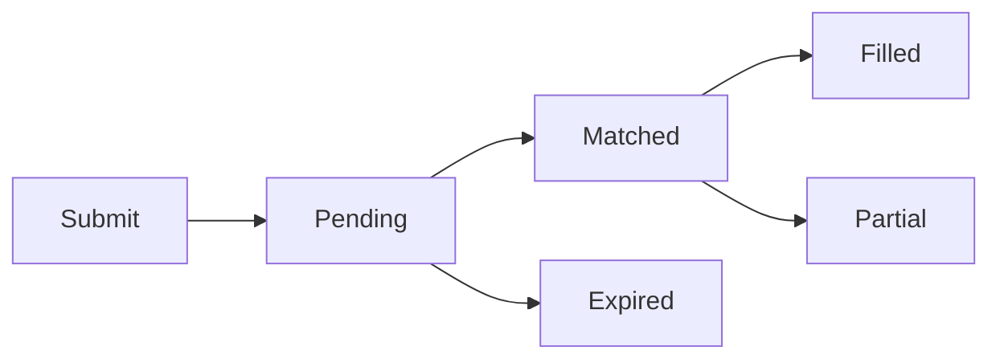

# Order Types

## The Payoff Vector

Every order on Sybil is a **payoff vector** — a specification of what you receive in each possible state of the world, plus a limit price you're willing to pay.

```
Order = (payoff_vector, limit_price, amount)
```

A single binary market has 2 states (YES, NO). Two markets have 4 states. Three markets have 8. The payoff vector assigns a payout to each state.

### Simple Orders Are Payoff Vectors

What looks like a "buy YES" is really a payoff vector with a single market:

| Order | Payoff Vector | Meaning |
|-------|---------------|---------|
| Buy YES on A | `[0, 1]` | Pay \$0 if NO, get \$1 if YES |
| Buy NO on A | `[1, 0]` | Get \$1 if NO, get \$0 if YES |

```json
{
  "markets": ["market_a"],
  "payoffs": [0, 100],
  "limit_price": 5500,
  "amount": 100
}
```

This buys 100 YES shares on market A at up to \$0.55 each. It's a payoff vector — just a simple one.

### Multi-Market Payoff Vectors

With 2 markets (A, B), there are 4 possible states:

| State | A | B |
|-------|---|---|
| 00 | NO | NO |
| 01 | NO | YES |
| 10 | YES | NO |
| 11 | YES | YES |

Now you can express any combination:

<CodeGroup>
```json "Buy YES on A (ignore B)"
{
  "payoffs": [0, 0, 100, 100],
  "limit_price": 5500
}
```

```json "A wins AND B wins"
{
  "payoffs": [0, 0, 0, 100],
  "limit_price": 2000
}
```

```json "A wins OR B wins"
{
  "payoffs": [0, 100, 100, 100],
  "limit_price": 8000
}
```

```json "A and B same outcome"
{
  "payoffs": [100, 0, 0, 100],
  "limit_price": 5000
}
```
</CodeGroup>

## Boolean Algebra

Since markets are binary, payoff vectors follow **boolean algebra**. Each market is a boolean variable, and you can combine them with standard operations:

| Operation | Formula | Payoff Vector (2 markets) | Meaning |
|-----------|---------|---------------------------|---------|
| A | A | `[0, 0, 1, 1]` | A wins |
| NOT A | 1 − A | `[1, 1, 0, 0]` | A loses |
| A AND B | A · B | `[0, 0, 0, 1]` | Both win |
| A OR B | A + B − A·B | `[0, 1, 1, 1]` | At least one wins |
| A XOR B | A + B − 2·A·B | `[0, 1, 1, 0]` | Exactly one wins |
| ALWAYS | 1 | `[1, 1, 1, 1]` | Guaranteed \$1 payout |

This isn't just notation — the matching engine reasons about orders algebraically. It can decompose, combine, and optimize across payoff vectors to find the welfare-maximizing allocation.

## Built-In Arbitrage

The payoff vector representation makes arbitrage detection natural. The engine doesn't need special arbitrage logic — it falls out of the algebra.

### Negrisk Arbitrage

Consider an event with 3 mutually exclusive outcomes (A, B, C). Exactly one wins. The prices should sum to 100%:

| Market | Price |
|--------|-------|
| "A wins" | 45% |
| "B wins" | 35% |
| "C wins" | 15% |
| **Total** | **95%** |

Prices sum to 95%. The payoff vector `[1, 1, 1]` (buy YES on all three) costs \$0.95 and always pays \$1.00 — guaranteed \$0.05 profit.

On a CLOB, an external arbitrageur races to capture this. On Sybil, the engine detects that `A + B + C = 1` (boolean tautology for mutually exclusive events) and **creates these fills automatically**. The \$0.05 surplus goes to improving prices for existing orders, not to an arb bot.

<Info>
**Why this works**: Because every order is a payoff vector, the engine can recognize that buying all outcomes of a mutually exclusive event is equivalent to buying a constant `[1, 1, 1, ...]`. When the cost is less than the guaranteed payout, it creates fills that close the gap — adding welfare instead of extracting it.
</Info>

### Overround Arbitrage

The reverse also applies. If prices sum to 105%, selling all three outcomes collects \$1.05 in premiums but only costs \$1.00 in payouts (exactly one winner) — guaranteed \$0.05 profit. The engine detects and resolves this too.

## Order Parameters

Every order, regardless of complexity, shares these parameters:

### Limit Price

The maximum you'll pay for the payoff vector. In **basis points** (1/100th of a percent):

| Price | Basis Points |
|-------|--------------|
| \$0.50 | 5000 |
| \$0.55 | 5500 |
| \$0.01 | 100 |

- **Buyers**: Fill at clearing price or lower
- **Sellers**: Fill at clearing price or higher

### Amount

Number of units. Each unit pays out according to the payoff vector.

### Expiration

- **Good until cancelled (GTC)**: Persist until filled or manually cancelled
- **Good until batch N**: Automatically expire after a specific batch

### All-or-Nothing (AON)

Must fill completely or not at all. Set `min_fill == amount`:

```json
{
  "markets": ["market_a"],
  "payoffs": [0, 100],
  "limit_price": 5500,
  "amount": 1000,
  "min_fill": 1000
}
```

<Warning>
AON orders may not fill even if there's partial liquidity available. Use only when you specifically need full execution.
</Warning>

### Conditional Activation

Orders that only activate when a price condition is met on another market:

```json
{
  "markets": ["market_b"],
  "payoffs": [0, 100],
  "limit_price": 7000,
  "amount": 100,
  "condition": {
    "market": "market_a",
    "threshold": 6000,
    "direction": "above"
  }
}
```

This order activates only if Market A's clearing price exceeds 60%.

## Order Lifecycle



| State | Description |
|-------|-------------|
| **Pending** | In the order book, waiting for match |
| **Matched** | Included in current batch, awaiting settlement |
| **Filled** | Fully executed |
| **Partial** | Partially filled, remainder still pending |
| **Expired** | Past expiration batch, removed |
| **Cancelled** | Manually cancelled by user |

## Cancellation

Orders can be cancelled anytime before matching:

```bash
DELETE /api/orders/{order_id}
```

<Info>
Cancellation is free. Collateral is returned immediately.
</Info>

## State Space

Each market doubles the number of states (2^n). Orders can span up to **5 markets** (32 states).

<Warning>
Orders spanning more than 5 markets are not supported due to state space explosion.
</Warning>
