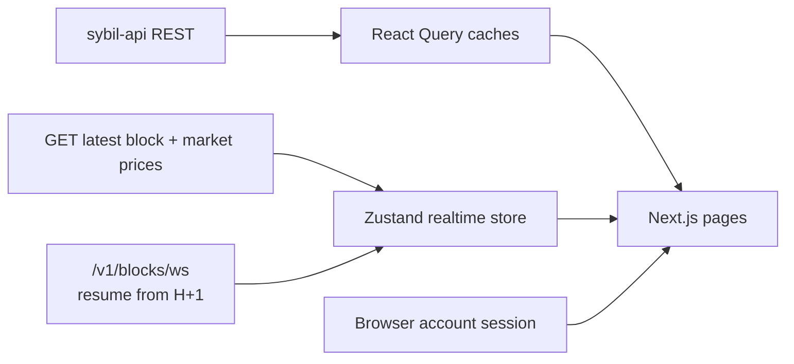

# Frontend/backend data map

> **Executive summary:** the web app hydrates stable reads through REST, then
> follows blocks and prices through the resumable WebSocket. This document maps
> pages to endpoint families and records trust/durability boundaries; it does
> not duplicate every rendered field or serve as a product backlog.

Last implementation audit: 2026-07-13. A Vitest guard checks that every path
named here exists in generated OpenAPI types and that every path called through
the frontend API client appears here.

## Data flow

- REST uses `src/lib/api/client.ts` and generated `schema.d.ts`.
- Realtime hydration reads `GET /v1/blocks/latest` and
  `GET /v1/markets/prices`, then opens `/v1/blocks/ws` with height resume.
- `/v1/blocks/stream` remains an SSE convenience for third parties; the web app
  uses WebSocket.
- Money is nanodollars (`1_000_000_000 = $1`); quantity is share units
  (`1000 = 1 share`). Application money arithmetic uses `bigint` helpers.

## Page map

| Surface | Primary reads | Client-side work |
|---|---|---|
| Global shell/connect | `/v1/health`, `/v1/accounts/{id}`, `/v1/accounts/{id}/portfolio`, `/v1/accounts/{id}/orders`, `/v1/markets`, `/v1/blocks/latest`, `/v1/blocks/ws` | Session identity, genesis signing domain, available cash, search, connection/countdown |
| Market index | `/v1/markets`, `/v1/markets/prices`, `/v1/markets/{id}/prices/history`, `/v1/events/{event_id}/traders`, `/v1/events/{event_id}/raw` | Event grouping, category choice, sparkline/delta, sorting |
| Market detail | `/v1/markets/{id}`, `/v1/markets`, `/v1/markets/groups`, `/v1/markets/{id}/prices/history`, `/v1/markets/{id}/prices/candles`, `/v1/events/{event_id}/raw`, `/v1/blocks/ws` | Chart alignment, event outcome labels, live mark/age, paged event-volume activity, complete-set admission preflight |
| Activity | `/v1/activity/overview`, `/v1/blocks`, `/v1/blocks/{height}`, `/v1/markets`, `/v1/markets/summary`, `/v1/bots/decisions` | Recent block merge, per-market presentation, unmatched counts |
| Leaderboard | `/v1/leaderboard` | Window selection and own-row highlight |
| Arena | `/v1/bots/decisions`, `/v1/bots/equity-series`, `/v1/activity/overview`, `/v1/markets/summary`, `/v1/blocks/latest`, `/v1/blocks/{height}` | Strategy grouping, cost/tokens, FV drift, recent charts |
| Portfolio | `/v1/accounts/{id}/portfolio`, `/v1/accounts/{id}/equity`, `/v1/accounts/{id}/orders`, `/v1/accounts/{id}/fills`, `/v1/accounts/{id}/events`, `/v1/accounts/{id}/bridge-key`, `/v1/accounts/{id}/withdrawals`, `/v1/markets`, `/v1/markets/{id}/prices/history`, `/v1/blocks/{height}` | Marks, realized PnL, history pagination, CSV export, exact L1 deposit routing key and truthful quarantine recovery guidance, current withdrawal status and ETA |
| Settings | `/v1/accounts/{id}`, `/v1/accounts/{id}/keys`, `/v1/accounts/{id}/keyop-state`, `/v1/accounts/{id}/api-keys` | Forms and state-bound signing preparation |
| Dev overview/markets | `/v1/markets/summary`, `/v1/markets/groups`, `/v1/orders/pending`, `/v1/blocks/latest`, `/v1/blocks/{height}` | Diagnostics and aggregate tables |
| Dev accounts | `/v1/accounts/{id}/portfolio`, `/v1/accounts/{id}/fills`, `/v1/orders/pending`, `/v1/markets/summary` | Multi-account diagnostic aggregation |
| Dev aggregates | `/v1/activity/overview`, `/v1/markets/summary`, `/v1/markets/{id}/open-batch`, `/v1/accounts/{id}/portfolio` | Indicative/open-batch and cost-basis panels |

`/m-dev/[id]` remains an explicitly mocked diagnostic presentation. Do not cite
its placeholder values as backend capabilities.

## Mutations used by the web app

| Endpoint | Role | Authorization |
|---|---|---|
| `POST /v1/accounts` | Create demo/onboarding account | Public creation policy; server limits apply |
| `POST /v1/accounts/{id}/keys` | Bootstrap first key only | Service-gated and zero-key-only |
| `POST /v1/accounts/{id}/fund` | Demo/service funding | Service-gated |
| `POST /v1/orders/signed` | Place GTC/IOC/GTD order | Registered RawP256/WebAuthn key + nonce |
| `POST /v1/orders/cancel/signed` | Cancel resting order | Registered RawP256/WebAuthn key + nonce |
| `POST /v1/accounts/{id}/profile` | Update display profile | Signed action |
| `POST /v1/accounts/{id}/keys/register` | Add signing key | State-bound active-key authorization |
| `POST /v1/accounts/{id}/keys/revoke` | Revoke signing key | State-bound active-key authorization; last key protected |
| `POST /v1/accounts/{id}/api-keys` | Create read bearer | Signed action; token shown once |
| `POST /v1/accounts/{id}/api-keys/revoke` | Revoke read bearer | Signed action |

Read API keys cannot authorize any mutation.

## Durability and trust

| Data | Authority / survival |
|---|---|
| Balances, positions, markets, groups, lifecycle, orders/reservations, bridge/withdrawal state | Committed exchange state; restored from fenced store/witness |
| Blocks and canonical witnesses | Durable store rows, subject to configured retention |
| Fills, candles, account events/equity | Private `sybil-history` projection fed by a fenced transactional outbox; never validity inputs. Responses expose indexed-through/completeness metadata and can return 503 while the independent projector is unavailable. |
| Platform/current aggregates | Sequencer-derived current read models; not validity inputs. Leaderboard bases are published once per committed block and window baselines come from `sybil-history`. |
| Market reference/display metadata | Off-block persisted JSON; mirror/operator supplied |
| Arena decisions/equity | Separate arena SQLite database |
| Browser session, selected tabs/filters | Local browser only |
| Live price/countdown | Rehydrated REST head plus WebSocket; transient client state |

The UI must not present off-block metadata, analytics, reference prices, or bot
reasoning as validity-proven. It may present them alongside proven exchange
state with clear provenance.

## Known gaps

- Activity batch-detail transaction hash, sequencer identity, and clearing
  duration remain placeholders.
- The browser arena does not expose every raw news/source record available to
  the Streamlit/operator view.
- JavaScript cannot safely parse arbitrary `u64` JSON numbers; see
  [`KNOWN_ISSUES.md`](KNOWN_ISSUES.md).
- Several diagnostic endpoints exist in OpenAPI but are intentionally unused by
  the product UI. OpenAPI—not this file—is the complete endpoint inventory.
- Quarantine status is aggregate-only. The portfolio can show an account's
  exact bridge key and recovery semantics, but it cannot assert that a specific
  deposit is quarantined without an owner-scoped quarantine read.

## Staleness guard

`web/src/lib/api/data-map.test.ts`, run by `pnpm test`, enforces two path-level
properties:

1. every concrete `/v1/...` path named here exists in `schema.d.ts`;
2. every path called through `api.GET/POST/...` in application source is named
   here.

The guard normalizes placeholder names (`{id}` and `{height}`), ignores doc-only
globs, and excludes smoke/tests. It does not verify method, query parameters,
response fields, prose accuracy, or dynamic `fetch`/WebSocket calls. Semantic
accuracy still requires review when a page or response shape changes.
